# Тема: Работа с Git
- **Студент: Конев Глеб Олегович**
- **Группа: ИВТ-23-1**
## Таблица выполнения заданий
| Задание | Выполнение |
|----------|----------|
| 1. Установка | + |
| 2. Настройка | + |
| 3. Создание нового репозитория | + |
| 4. Подготовка файлов | + |
| 5. Фиксация изменений | + |
| 6. Подключение к удаленному репозиторию | + |
| 7. Ветвление | + |
| 8. Особенности применения «Фетч» | + |
| 9. Удаление файлов, веток, локальных и удалённых репозиториев | + |
| 10. Отслеживание изменений в коммитах | + |
| 11. Возвращение файла к предыдущему (определенному) состоянию | + |
| 12. Возвращение к предыдущему коммиту | + |
| 13. Исправление коммита | + |
| 14. Разрешение конфликтов при слиянии | + |
| 15. Настройка .gitignore | + |

знак "+" - задание выполнено; знак "-" - задание не выполнено;

Работу проверили: 

- Ассистент кафедры информационных технологий и статистики, Ротенштрайх Татьяна Викторовна

## Задание 1 - Установка

**Скриншот результата:**
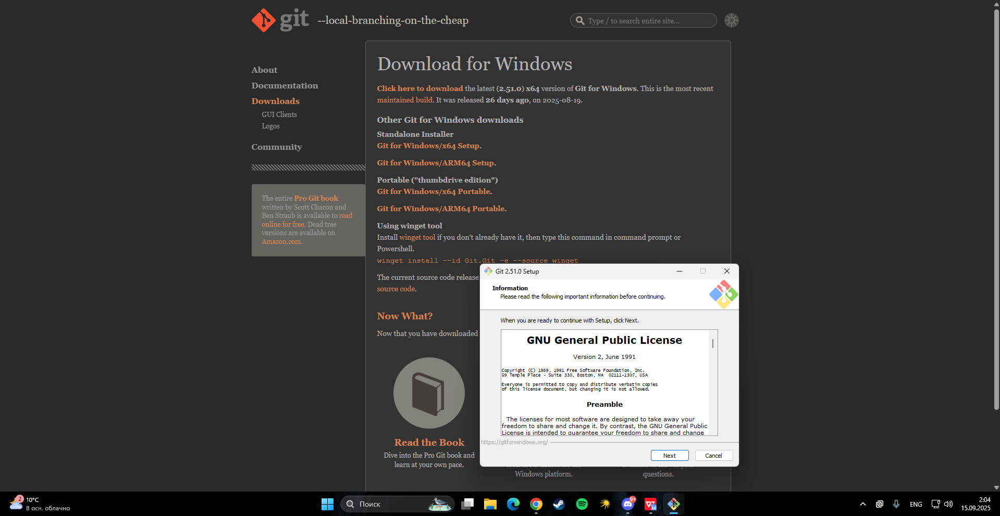
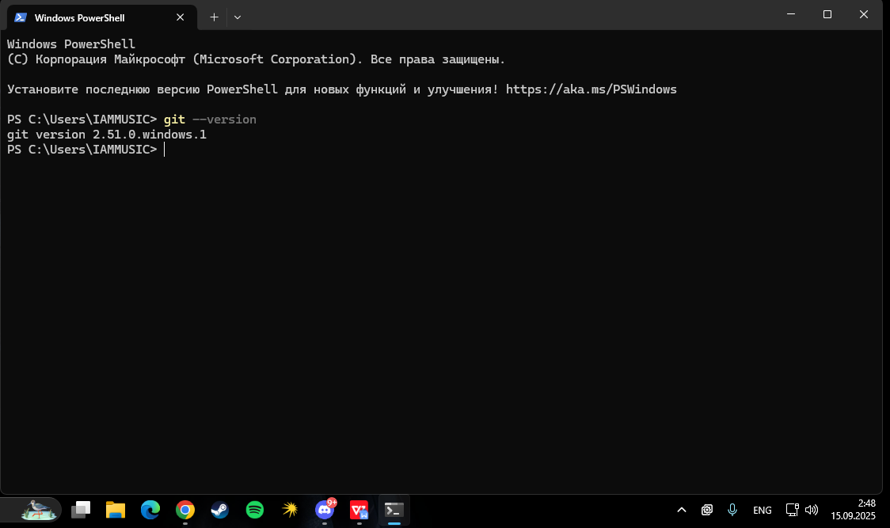
**Вывод:** Установил Git на компьютер, проверил версию.

## Задание 2 - Настройка
**Скриншот результата:**
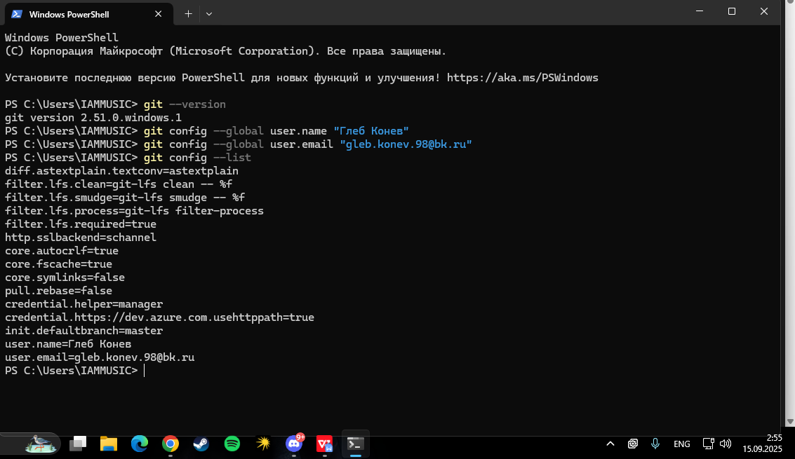
Настройка глобальных параметров Git - имя пользователя и email они будут использоваться в коммитах.

## Задание 3 Создание нового репозитория
**Скриншот результата:**
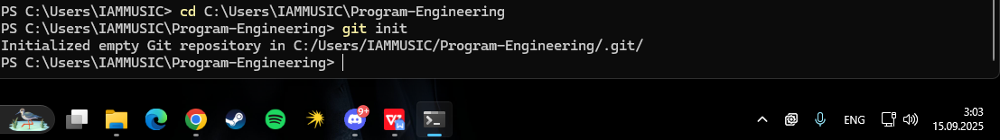
**Вывод:**  Новый локальный репозиторий с помощью команды `git init`, итог - пустая git-база.

## Задание 4: Подготовка файлов
**Скриншот результата:**
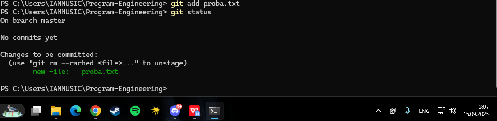
**Вывод:** Подготовил их к коммиту.Добавил файлы в staging area.

## Задание 5: Фиксация изменений
**Скриншот результата:**
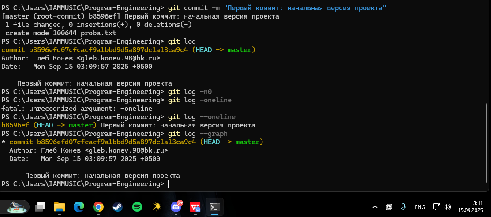
**Вывод:** Выполнил первый коммит с описанием изменений, зафиксировал текущее состояние файлов.

## Задание 6: Подключение к удаленному репозиторию
**Скриншот результата:**
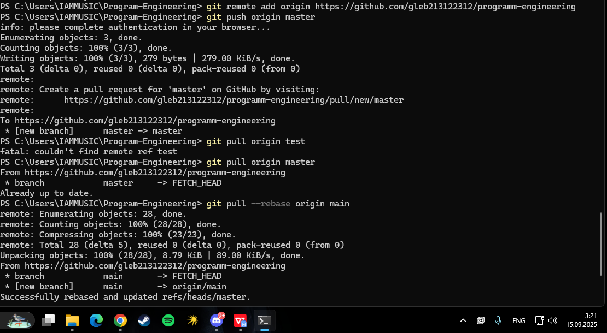
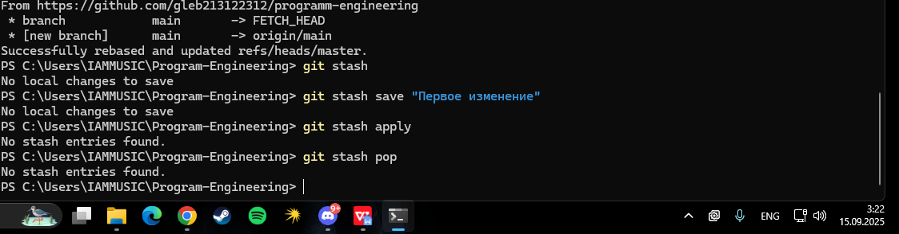
**Вывод:** Подключил локальный репозиторий к удаленному на GitHub.

## Задание 7: Ветвление
**Скриншот результата:**
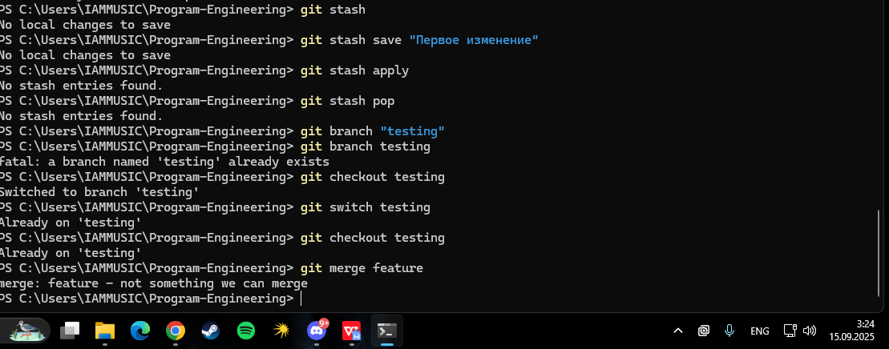
**Вывод:** Создал новую ветку и переключился на нее, освоил работу с ветвлением.

## Задание 8: Особенности применения «Фетч»
**Скриншот результата:**
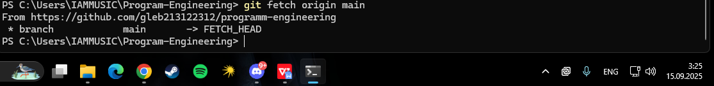
**Вывод:** Использовал команду `git fetch` для получения изменений с удаленного репозитория без автоматического слияния.

## Задание 9: Удаление файлов, веток, локальных и удалённых репозиториев
**Скриншот результата:**
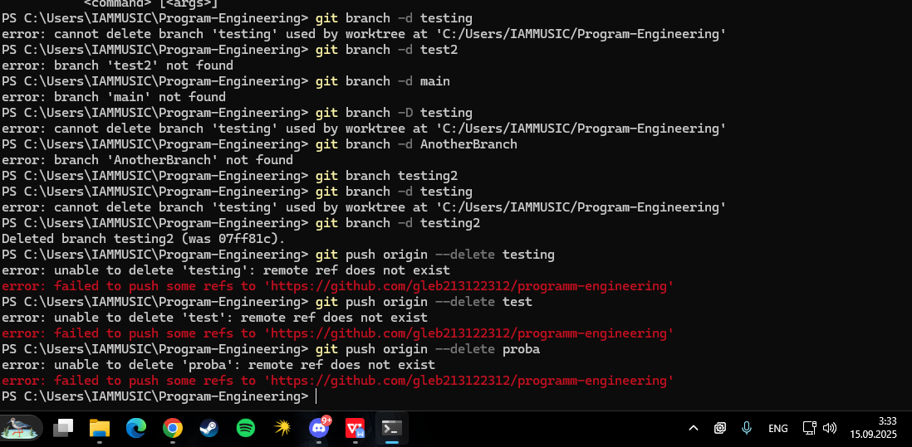
**Вывод:** Освоил удаление файлов из репозитория и управление ветками.
