# Тема 2. Операторы, условия, циклы
Отчет по Теме #3 выполнил:
- Еськин Егор Максимович
- ИВТ-23-1

| Задание | Лаб_раб | Сам_раб |
| ------ | ------ | ------ |
| Задание 1 | + | + |
| Задание 2 | + | + |
| Задание 3 | + | + |
| Задание 4 | + | + |
| Задание 5 | + | + |
| Задание 6 | + |  |
| Задание 7 | + |  |
| Задание 8 | + |  |
| Задание 9 | + |  |
| Задание 10 | + |  |

знак "+" - задание выполнено; знак "-" - задание не выполнено;

Работу проверили:
- Ассистент кафедры информационных технологий и статистики, Ротенштрайх Татьяна ВикторовнаА.

## Лабораторная работа №1
### Создайте две переменные, значение которых будете вводить через консоль. Также составьте условие, в котором созданные ранее переменные будут сравниваться, если условие выполняется, то выведете в консоль «Выполняется», если нет, то «Не выполняется».

```python
one = int(input('Введите значение первой переменной: '))
two = int(input('Введите значение второй переменной: '))
if one>two:
    print('Выполняется')
else:
    print('Не выполняется')
```
### Результат.
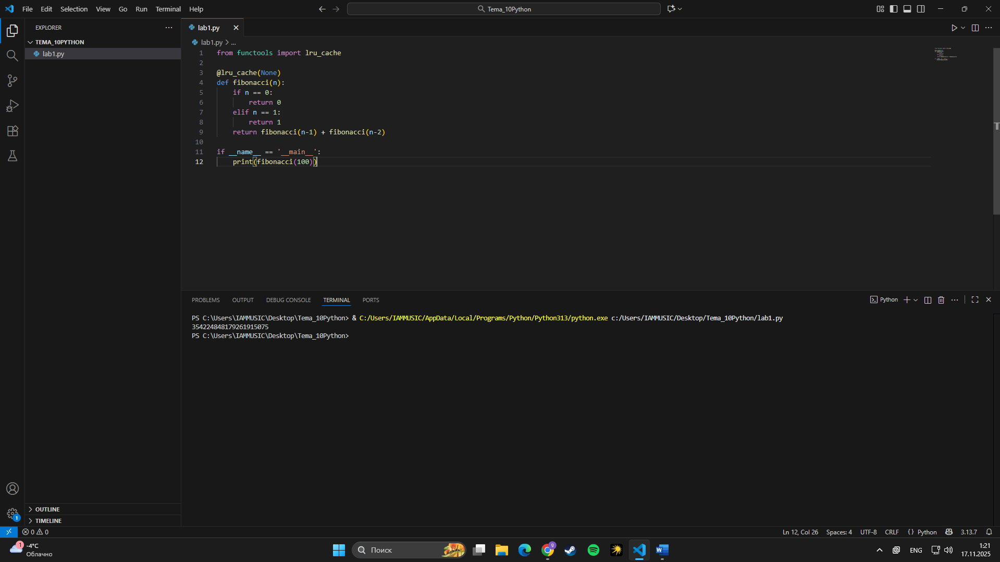

## Лабораторная работа №2
### Напишите программу, которая будет определять значение переменной: меньше 0, больше 0 и меньше 10 или больше 10. Это нужно реализовать при помощи одной переменной, значение которой будет вводиться через консоль, а также при помощи конструкции if, elif, else.
```python
one = int(input('Введите значение переменной: '))
if one < 0:
    print('Переменная меньше 0')
elif 0 < one < 10:
    print('Переменная больше 0 и меньше 10')
else: 
    print('Переменная больше 10')
```
### Результат.
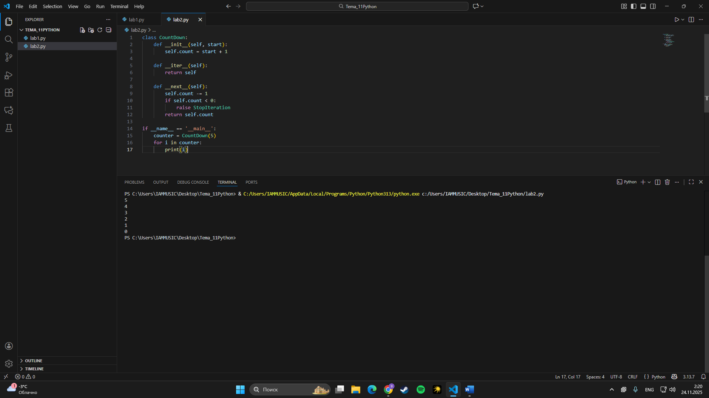

## Лабораторная работа №3
### Напишите программу, в которой будет проверяться есть ли переменная в указанном массиве используя логический оператор in. Самостоятельно посмотрите, как работает программа со значениями которых нет в массиве numbers.
```python
numbers = [1, 3, 4, 6, 8, 9]
value = int(input('Введите значение переменной: '))
if value in numbers:
    print('Переменная есть в данном массиве')
else: 
    print('Переменной нет в этом массиве')
```
### Результат.
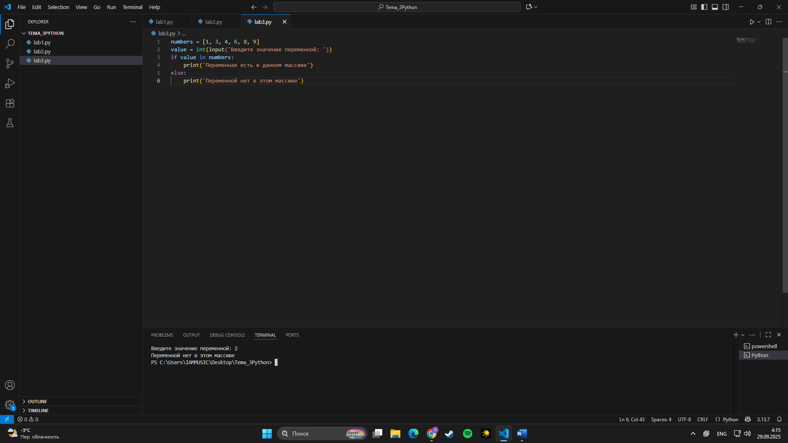
  
## Лабораторная работа №4
### Напишите программу, которая будет определять находится ли переменная в указанном массиве и если да, то проверите четная она или нет. Самостоятельно протестируйте данную программу с разными значениями переменной value.
```python
numbers = [1, 3, 4, 6, 8, 9, 15, 16, 73, 321, 322]
value = int(input('Введите значение переменной: '))
if value in numbers:
    if value % 2 == 0:
        print('Переменная четная и есть в массиве numbers')
    else: 
        print('Переменная нечетная и есть в массиве numbers')
else: 
    print(f"Переменной нет в массиве numbers и она равна {value}")
```
### Результат.
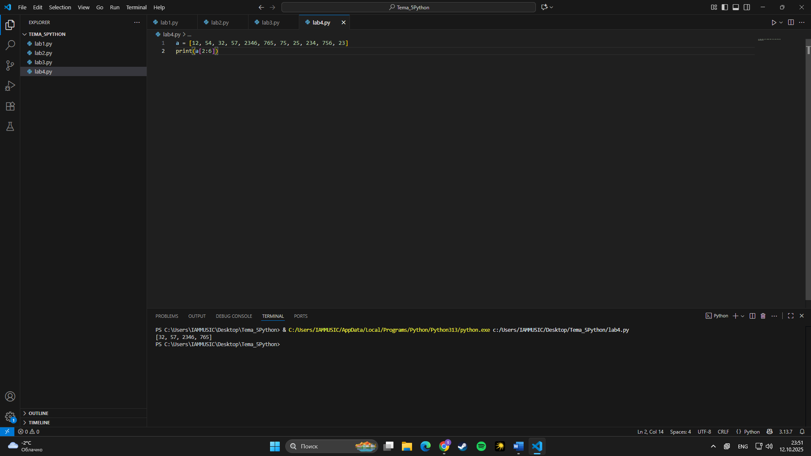

## Лабораторная работа №5
### Напишите программу, в которой при помощи цикла for значения переменной будут меняться от 0 до 10 и посмотрите, как разные виды сравнений и операций работают в цикле.
```python
for i in range(10):
    print('i = ', i)
    if i == 0:
        i+=2
    if i == 1:
        continue
    if i == 2 or i == 3:
        print('Переменная равна 2 или 3')
    elif i in [4, 5, 6]:
        print('Переменная равна 4, 5 или 6')
    else:
        break
```
### Результат.
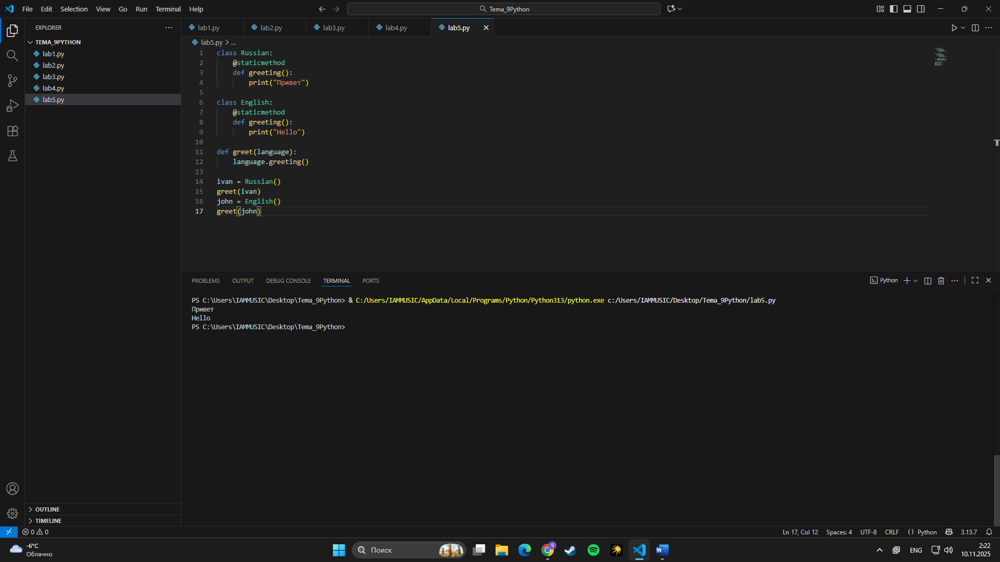

## Лабораторная работа №6
### Напишите программу, в которой при помощи цикла for определяется есть ли переменная value в строке string и посмотрите, как работает оператор else для циклов. Самостоятельно посмотрите, что выведет программа, если значение переменной value оказалось в строке string.
```python
string = "Привет всем изучащим Python!"
value = input()
for i in string:
    if i == value:
        index = string.find(value)
        print(f"Буква '{value}' есть в строке под {index} индексом")
        break
else:
    print(f"Буквы '{value}' нет в указанной строке")    
```
### Результат.
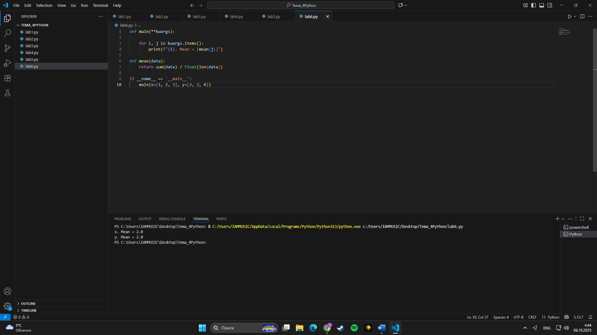

## Лабораторная работа №7
### Напишите программу, в которой вы наглядно посмотрите, как работает цикл for проходя в обратном порядке, то есть, к примеру не от 0 до 10, а от 10 до 0. В уже готовой программе показано вычитание из 100, а вам во время реализации программы будет необходимо придумать свой вариант применения обратного цикла.
```python
value = 100
for i in range(10, -1, -1):
    value -= i+3
    print(i, value)
```
### Результат.
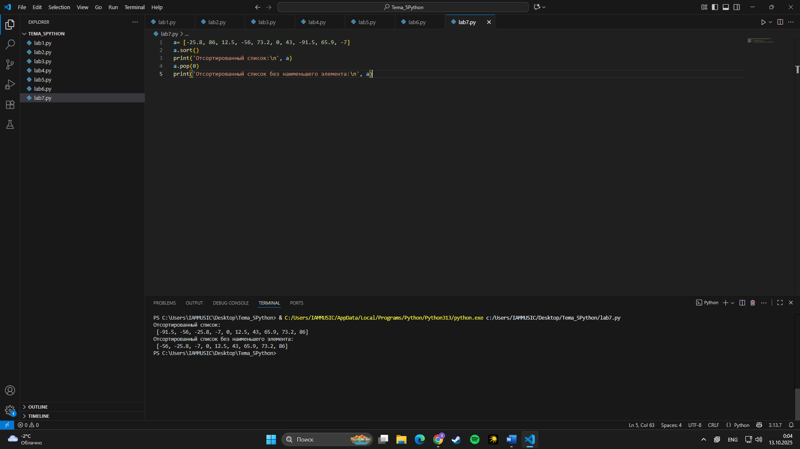

## Лабораторная работа №8
### Напишите программу используя цикл while, внутри которого есть какие-либо проверки.
```python
value = 0 
while value < 100:
    if value == 0:
        value += 10
    elif value // 5 > 1:
        value *= 5
    else:
        value -= 5
    print(value)
```
### Результат.
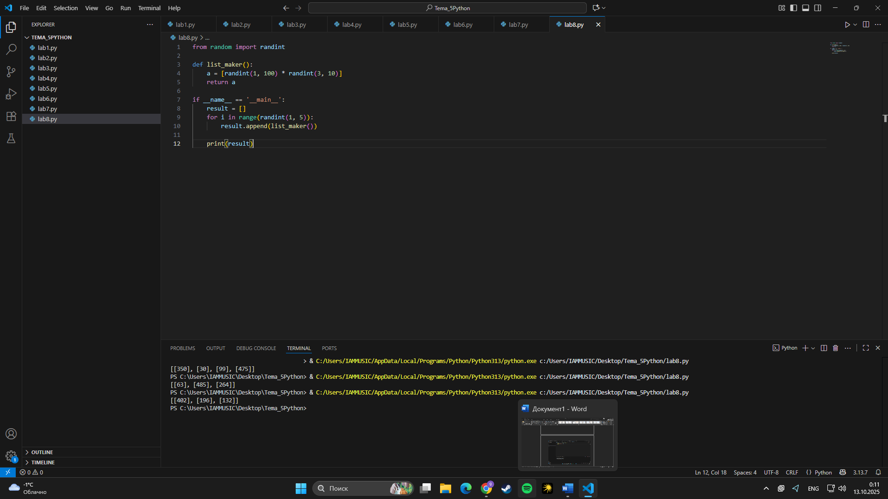

## Лабораторная работа №9
### Напишите программу с использованием вложенных циклов и одной проверкой внутри них. Самое главное, не забудьте, что нельзя использовать одинаковые имена итерируемых переменных, когда вы используете вложенные циклы.
```python
value = 0
for i in range(10):
    for j in range(10):
        if i != j:
            value += j
        else: 
            pass
print(value)
```
### Результат.
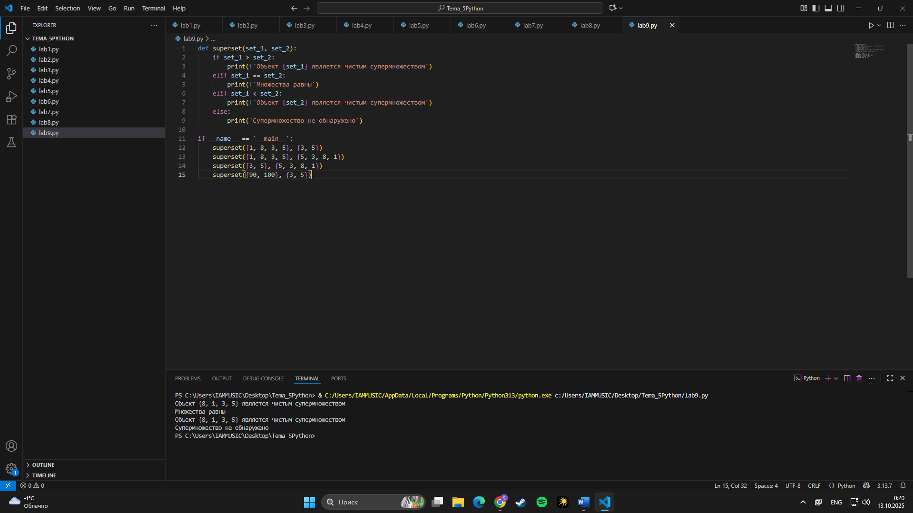

## Лабораторная работа №10
### Напишите программу с использованием flag, которое будет определять есть ли нечетное число в массиве. В данной задаче flag выступает в роли индикатора встречи нечетного числа в исходном массиве, четных чисел.
```python
even_array = [2, 4, 6, 8, 9]
flag = False
for value in even_array:
    if value % 2 == 1:
        flag = True

if flag is True:
    print('В массиве есть нечетное число')
else:
    print('В массиве все числа четные')
```
### Результат.
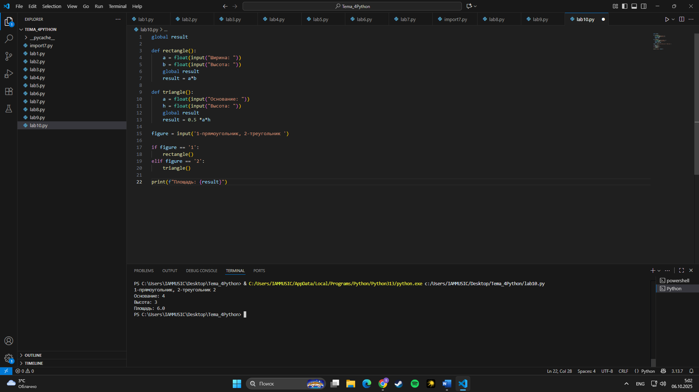

## Самостоятельная работа №1
### Напишите программу, которая преобразует 1 в 31.
Для выполнения поставленной задачи необходимо обязательно и только один раз использовать:

- Цикл for
  - *= 5
  - += 1

Никаких других действий или циклов использовать нельзя.
```python
x = 1
for i in range(2):
    x *= 5
    x += 1
print(x)
```
### Результат.
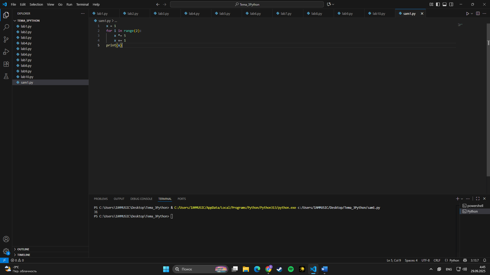

## Выводы
В данной задаче начальное значение x = 1.

В цикле for выполняем две итерации:

x = 1 * 5 = 5, затем x = 5 + 1 = 6.

x = 6 * 5 = 30, затем x = 30 + 1 = 31.

Результат: 31.
  
## Самостоятельная работа №2
### Напишите программу, которая переворачивает «Hello World» в обратном порядке, и каждая буква находится в отдельной строке консоли.
```python
word = "Hello World"[::-1]
for char in word: 
    print(char)
```
### Результат.
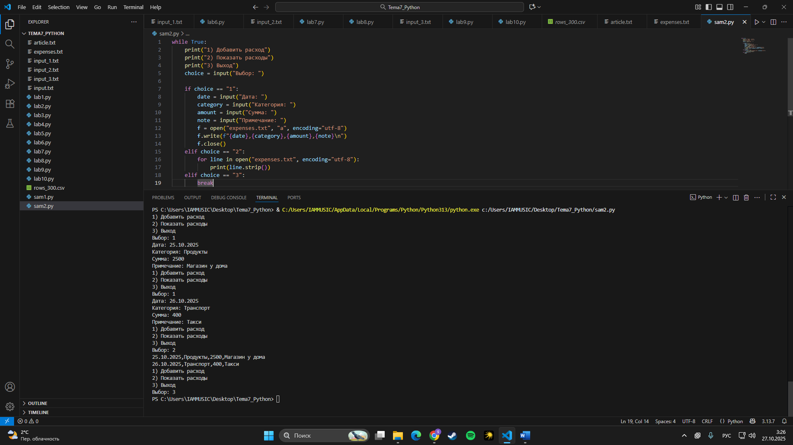

## Выводы
Строка кода с reversed("Hello World") разворачивает строку.

Цикл for выводит каждый символ в обратном порядке на отдельной строке.
  
## Самостоятельная работа №3
### Напишите программу, на вход которой поступает значение из консоли, оно должно быть числовым и в диапазоне от 0 до 10 включительно (это необходимо учесть в программе). Если вводимое число не подходит по требованиям, то необходимо вывести оповещение об этом в консоль и остановить программу. Код должен вычислять в каком диапазоне находится полученное число. Нужно учитывать три диапазона:

- от 0 до 3 включительно
- от 3 до 6
- от 6 до 10 включительно

Результатом работы программы будет выведенный в консоль диапазон. Программа должна занимать не более 10 строчек в редакторе кода.
```python
x = int(input())
if x < 0 or x > 10: 
    print("Неверный диапазон") 
    exit()
if x <= 3: 
    print("от 0 до 3 включительно")
elif x <= 6: 
    print("от 3 до 6")
else: 
    print("от 6 до 10 включительно")
```
### Результат.
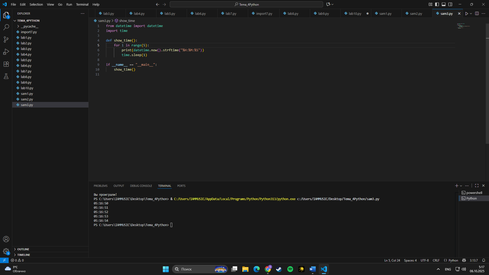

## Выводы
Пример работы:

Ввод: 5 → Вывод: от 3 до 6.

Ввод: 11 → Вывод: Число вне диапазона.

Объяснение: проверяем, что число в диапазоне [0, 10]. Если нет — выводим ошибку и завершаем программу. Определяем диапазон и выводим соответствующее сообщение.
## Самостоятельная работа №4
### Манипулирование строками. Напишите программу на Python, которая принимает предложение (на английском) в качестве входных данных от пользователя. Выполните следующие операции и отобразите результаты:

- Выведите длину предложения.
- Переведите предложение в нижний регистр.
- Подсчитайте количество гласных (a, e, i, o, u) в предложении.
- Замените все слова "ugly" на "beauty".
- Проверьте, начинается ли предложение с "The" и заканчивается ли на "end".

Проверьте работу программы минимум на 3 предложениях, чтобы охватить проверку всех поставленных условий.
```python
sentence = input("Введите предложение на английском: ")

print("Длина предложения:", len(sentence))

print("В нижнем регистре:", sentence.lower())

vowels = ['a', 'e', 'i', 'o', 'u']
count=0
for char in sentence.lower():
    if char in vowels:
        count+=1

print("После замены:", sentence.replace("ugly", "beauty"))

if sentence.startswith("The"):
    print("Начинается с 'The':", sentence.startswith("The"))
if sentence.endswith("end"):
    print("Заканчивается на 'end':", sentence.endswith("end"))
```
### Результат.
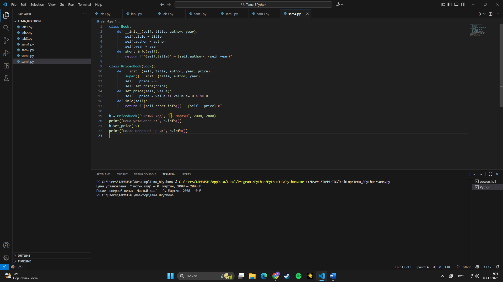

## Выводы
len(sentence) — длина строки.

sentence.lower() — перевод в нижний регистр.

Гласные подсчитываются через генератор списка.

replace("ugly", "beauty") заменяет все вхождения "ugly".

startswith()/endswith() проверяют начало и конец строки.
  
## Самостоятельная работа №5
### Составьте программу, результатом которой будет вывод в консоль:
hello world
hello
hello world
hello
hello world
hello
hello world
hello
hello world
hello
hello world

```python
string = 'hello'
values = [0, 2, 4, 6, 8, 10]
counter = 0
while ' world' not in string:
    memory = string
    if counter in values:
        string+= ' world'
    print(string)
    if counter <10:
        string = memory
    counter +=1
```
### Результат.
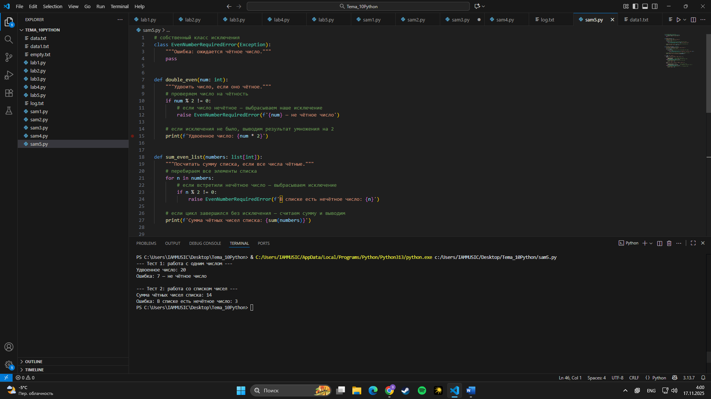

## Выводы
Цикл выполняется, пока в строке нет подстроки ' world'.

На шагах counter = 0, 2, 4, 6, 8, 10 к строке добавляется ' world', после чего строка выводится.

Строка возвращается к исходному значению 'hello', если counter < 10.

На последней итерации (counter = 10) строка не сбрасывается, и цикл завершается.

## Общий вывод

На основе решенных задач можно сделать следующие выводы:

1. Базовые конструкции
   
- Операторы (=, +=, *= и др.) - для преобразования данных

- Условия (if/elif/else) - для ветвления программы

- Циклы (for, while) - для повторяющихся действий

2. Взаимосвязь

- Операторы преобразуют данные

- Условия направляют поток выполнения

- Циклы обеспечивают многократное выполнение

3. Практическое применение
   
- Обработка данных и строк

- Валидация входных значений

- Создание сложной логики программ

Эти три элемента образуют фундамент программирования и позволяют решать большинство базовых задач.
