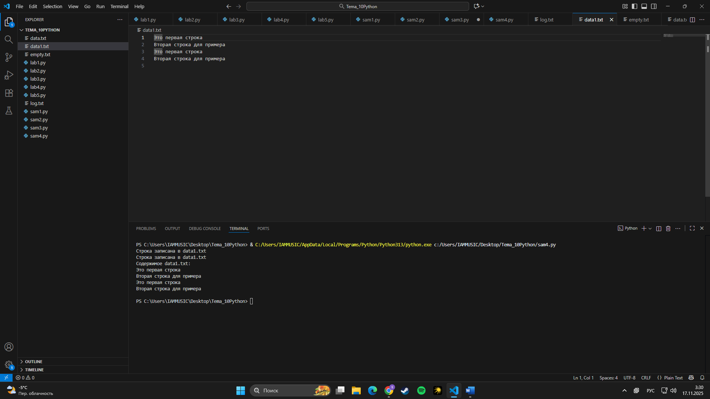
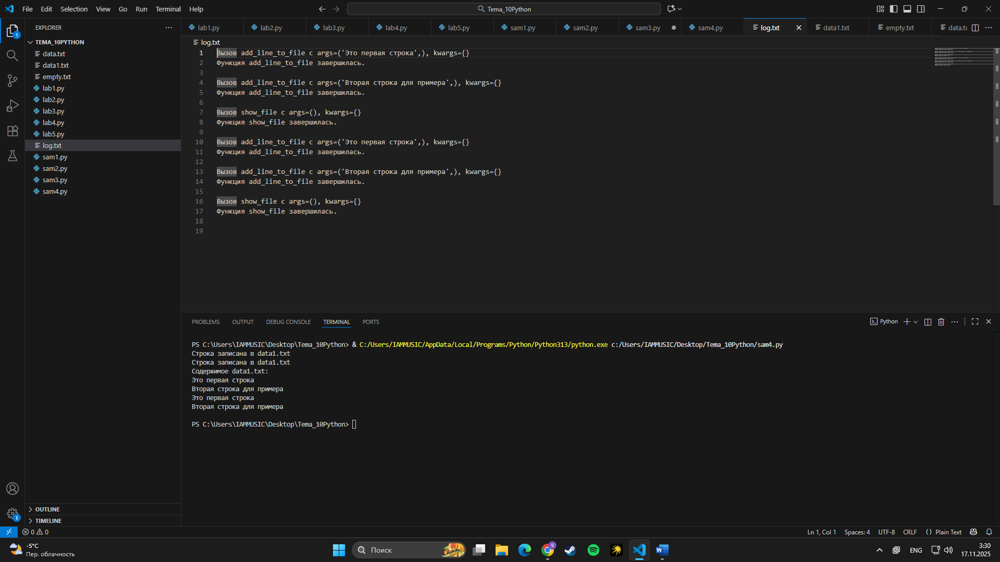

# Тема 10. Декораторы и исключения
Отчет по Теме #10 выполнил:
- **Студент: Конев Глеб Олегович**
- **Группа: ИВТ-23-1**

| Задание | Лаб_раб | Сам_раб |
| ------ | ------ | ------ |
| Задание 1 | + | + |
| Задание 2 | + | + |
| Задание 3 | + | + |
| Задание 4 | + | + |
| Задание 5 | + | + |

знак "+" - задание выполнено; знак "-" - задание не выполнено;

Работу проверил:
- Ассистент кафедры информационных технологий и статистики, Ротенштрайх Татьяна Викторовна.

## Лабораторная работа №1
### Написать рекурсивную программу для вычисления числа Фибоначчи для 100, замерить время работы с декоратором @lru_cache.

``` python
from functools import lru_cache

@lru_cache(None)
def fibonacci(n):
    if n == 0:
        return 0
    elif n == 1:
        return 1
    return fibonacci(n-1) + fibonacci(n-2)

if __name__ == '__main__':
    print(fibonacci(100))
```

### Результат:


## Лабораторная работа №2
### Сделать декоратор для функции регистрации, который принимает все аргументы, но проверяет только первые два: имя и возраст. Декоратор должен пропускать вызов функции, только если возраст > 0 и < 130, иначе выводить/вызывать ошибку.

```python
def check(input_func):
    def output_func(*args):
        name, age = args[0], args[1]
        if age < 0 or age > 130:
            age = 'Недопустимый возраст'
        input_func(name, age)
    return output_func

@check
def personal_info(name, age):
    print(f"Name: {name} Age: {age}")

if __name__ == '__main__':
    personal_info('Владимир', 38)
    personal_info('Александр', -5)
    personal_info('Петр', 138, 15, 48, 2)
```
### Результат:


## Лабораторная работа №3
### Сделать функцию, которая принимает только `int`, и защитить её с помощью исключений: при передаче `str` (или другого неправильного типа) ошибка должна перехватываться, а программа сообщать о проблеме или об успешном выполнении (через `try/except/finally`).

```python
def data(*args):
    try:
        for i in range(len(*args)):
            try:
                result = (args[0][i] * 15) // 10
                print(result)
            except Exception as ex:
                print(ex)
    except Exception as ex:
        print(ex)
    finally:
        print('Вся информация обработана')


if __name__ == '__main__':
    data([1, 15, 'Hello', 'i', 'try', 'to', 'crash', 'your', 'site', 38, 45])
```
### Результат:

  
## Лабораторная работа №4
### Сделать собственный класс исключения и использовать его в функции проверки имени при регистрации: если длина имени > 10 символов — выбрасывать это исключение, иначе выводить в консоль "Успешная регистрация".

```python
class NegativeValueException(Exception):
    pass


def check_name(name):
    if len(name) > 10:
        raise NegativeValueException('Длина более 10 символов')
    else:
        print('Успешная регистрация')


if __name__ == '__main__':
    name = '12345678910'
    check_name(name)

```

### Результат:


## Лабораторная работа №5
### Сделать класс-декоратор-логгер с методами `__init__` и `__call__`, который при каждом вызове декорируемой функции выводит в консоль простые логи о её запуске и завершении.

```python
class SiteChecker:
    def __init__(self, func):
        print('> Класс SiteChecker метод __init__ — успешный запуск')
        self.func = func

    def __call__(self):
        print('> Проверка перед запуском', self.func.__name__)
        self.func()
        print('> Проверка безопасного выключения')


@SiteChecker
def site():
    print('Усердная работа сайта')


if __name__ == '__main__':
    print('>> Сайт запущен')
    site()
    print('>> Сайт выключен')

```
### Результат:


## Самостоятельная работа №1
### Сделать декоратор, который с помощью модуля time измеряет и выводит время выполнения декорируемой функции, и применить его к указанной функции.

```python
import time


def timer_decorator(func):
    def wrapper(*args, **kwargs):
        start = time.time()
        result = func(*args, **kwargs)
        end = time.time()
        print(f"\nВремя выполнения: {end - start:.6f} сек")
        return result
    return wrapper


@timer_decorator
def fibonacci():
    fib1 = fib2 = 1

    for i in range(2, 200):
        fib1, fib2 = fib2, fib1 + fib2
        print(fib2, end=' ')


if __name__ == '__main__':
    fibonacci()

```
### Результат:


## Вывод:
Программа считает числа Фибоначчи (со 2-го по 200-е) и выводит их в консоль.
Для измерения времени работы функции fibonacci() используется самописный декоратор @timer_decorator, который:
- принимает функцию как аргумент;
- перед её вызовом запоминает текущее время (time.time());
- после выполнения функции снова берёт время и выводит разницу — время выполнения программы.
  
## Самостоятельная работа №2
### Сделать программу, которая читает данные из файла и обёрнута в обработку исключений: если файл пустой — вызвать исключение и вывести в консоль "файл пустой"; если файл не пустой — вывести его содержимое.

```python
def read_file(filename):
    try:
        with open(filename, 'r', encoding='utf-8') as f:
            content = f.read()

            if not content.strip():         
                raise ValueError('файл пустой')

            print(f'Содержимое файла "{filename}":')
            print(content)

    except ValueError as ex:
        print(f'Исключение: {ex}')
    except FileNotFoundError:
        print(f'Файл "{filename}" не найден')
    finally:
        print(f'Проверка файла "{filename}" завершена.\n')


if __name__ == '__main__':
    read_file('empty.txt')
    read_file('data.txt')

```
### Результат:


## Вывод:
Программа читает данные из файла и проверяет, пустой он или нет.
Если файл пустой, внутри read_file выбрасывается ValueError("файл пустой"), который перехватывается в except, и в консоль выводится сообщение об исключении.
Если файл не пустой, программа выводит содержимое файла.
Также используется конструкция try/except/finally: в finally всегда печатается сообщение о завершении проверки файла.

## Самостоятельная работа №3
### Сделать функцию, которая с помощью input() берёт число, складывает его с 2 и: если ввод можно преобразовать к числу — выводит результат; если введена строка/неподходящий тип — в except выводит "Неподходящий тип данных. Ожидалось число.".

```python
def add_two():
    try:
        user_input = input("Введите число: ")
        number = float(user_input)      
        result = 2 + number
        print(f"Результат: {result}")
    except (ValueError, TypeError):
        print("Неподходящий тип данных. Ожидалось число.")


if __name__ == "__main__":
    add_two()

```
### Результат:


## Вывод:
Программа запрашивает у пользователя число через input(), пытается привести его к float и сложить с 2.
Если ввод корректный (например 5), выводится результат сложения (Результат: 7.0).
Если пользователь введёт строку или другой неподходящий тип (что нельзя преобразовать к числу), в блоке except (ValueError, TypeError) выведется сообщение:
"Неподходящий тип данных. Ожидалось число.".

## Самостоятельная работа №4
### Сделать собственный, новый декоратор-класс и использовать его для двух придуманных функций, связанных по смыслу.

```python
class FileLogger:
    """Декоратор-класс: логирует вызовы функций в log.txt"""

    def __init__(self, func):
        self.func = func
        self.log_file = 'log.txt'   # лог пишем сюда

    def __call__(self, *args, **kwargs):
        # логируем перед вызовом
        with open(self.log_file, 'a', encoding='utf-8') as f:
            f.write(f'Вызов {self.func.__name__} с args={args}, kwargs={kwargs}\n')

        result = self.func(*args, **kwargs)

        # логируем после вызова
        with open(self.log_file, 'a', encoding='utf-8') as f:
            f.write(f'Функция {self.func.__name__} завершилась.\n\n')

        return result


@FileLogger
def add_line_to_file(text):
    """Добавляет строку в data1.txt"""
    with open('data1.txt', 'a', encoding='utf-8') as f:
        f.write(text + '\n')
    print('Строка записана в data1.txt')


@FileLogger
def show_file():
    """Печатает содержимое data1.txt"""
    print('Содержимое data1.txt:')
    with open('data1.txt', 'r', encoding='utf-8') as f:
        print(f.read())


if __name__ == '__main__':
    add_line_to_file('Это первая строка')
    add_line_to_file('Вторая строка для примера')
    show_file()

```
### Результат:




## Вывод:
Программа реализует класс-декоратор FileLogger, который логирует вызовы функций в файл log.txt:
в __init__ сохраняется ссылка на исходную функцию;
в __call__ перед вызовом и после него в log.txt записываются имя функции и её аргументы.
Декоратор используется для двух функций:
add_line_to_file — добавляет строку в файл data1.txt и пишет сообщение в консоль.
show_file — считывает и выводит содержимое data1.txt.
  
## Самостоятельная работа №5
### Сделать новый класс собственного исключения и использовать его в двух разных фрагментах кода (в двух местах), обрабатывая его через try/except.

```python
# собственный класс исключения
class EvenNumberRequiredError(Exception):
    """Ошибка: ожидается чётное число."""
    pass


def double_even(num: int):
    """Удвоить число, если оно чётное."""
    # проверяем число на чётность
    if num % 2 != 0:
        # если число нечётное — выбрасываем наше исключение
        raise EvenNumberRequiredError(f'{num} — не чётное число')

    # если исключения не было, выводим результат умножения на 2
    print(f'Удвоенное число: {num * 2}')


def sum_even_list(numbers: list[int]):
    """Посчитать сумму списка, если все числа чётные."""
    # перебираем все элементы списка
    for n in numbers:
        # если встретили нечётное число — выбрасываем исключение
        if n % 2 != 0:
            raise EvenNumberRequiredError(f'В списке есть нечётное число: {n}')

    # если цикл завершился без исключения — считаем сумму и выводим
    print(f'Сумма чётных чисел списка: {sum(numbers)}')


if __name__ == '__main__':
    print('--- Тест 1: работа с одним числом ---')
    try:
        double_even(10)    # корректное чётное число
        double_even(7)     # здесь будет выброшено исключение
    except EvenNumberRequiredError as ex:
        # обработка нашего пользовательского исключения
        print('Ошибка:', ex)

    print('\n--- Тест 2: работа со списком чисел ---')
    try:
        sum_even_list([2, 4, 8])          # все числа чётные
        sum_even_list([2, 3, 8, 10])      # в списке есть нечётное число 3
    except EvenNumberRequiredError as ex:
        # обработка того же исключения во втором фрагменте кода
        print('Ошибка:', ex)

```
### Результат:


## Вывод:
Программа вводит собственное исключение EvenNumberRequiredError, которое срабатывает, если встречается нечётное число.
Это исключение используется в двух местах:
double_even(num) — удваивает число, но если оно нечётное, выбрасывает EvenNumberRequiredError.
sum_even_list(numbers) — считает сумму списка только если все числа чётные; при первом нечётном числе тоже выбрасывается EvenNumberRequiredError.
В блоке if __name__ == '__main__': выполняются два теста, каждый обёрнут в try/except, где это пользовательское исключение перехватывается и его сообщение выводится в консоль.

## Общие выводы по работе:
За время выполнения этих задач я:

Научился работать с декораторами.
В первой задаче я реализовал декоратор, который измеряет время выполнения функции с вычислением чисел Фибоначчи. Для этого использовал модуль time и понял, как оборачивать функцию в дополнительную логику, не меняя её код.

Освоил обработку ошибок при работе с файлами.
Во второй задаче я писал программу, которая читает данные из файлов и с помощью try/except/finally обрабатывает ситуацию, когда файл пустой или не найден. Так я закрепил работу с файлами (open, чтение/запись) и стандартные исключения (ValueError, FileNotFoundError).

Потренировался проверять корректность пользовательского ввода.
В третьей задаче функция брала число через input(), пыталась сложить его с 2 и ловила ошибки типов (ValueError, TypeError). Если ввод неправильный, выводилось сообщение: «Неподходящий тип данных. Ожидалось число.». Так я закрепил базовую валидацию данных через исключения.

Сделал собственный декоратор-логгер.
В четвёртой задаче я написал класс-декоратор FileLogger, который логирует вызовы функций в файл log.txt и работал сразу с двумя функциями, связанными с файлом data1.txt. Здесь я совместил декораторы, работу с классами и файловый ввод-вывод.

Создал своё исключение и использовал его в двух местах.
В пятой задаче я придумал собственный класс исключения EvenNumberRequiredError, которое выбрасывается, если число нечётное. Это исключение использовалось в двух разных функциях и обрабатывалось через try/except, что помогло лучше понять, как писать и применять пользовательские исключения.

В целом в этой работе я освоил навыки:
- написание и применение декораторов (функциональных и классовых);
- обработка исключений, в том числе собственных;
- работа с файлами и логированием;
- проверка корректности пользовательского ввода.

Все задачи связаны общей идеей — сделать код более безопасным, удобным для отладки и контролируемым за счёт декораторов и исключений.
Выполненные задания демонстрируют практическое применение этих концепций и формируют прочную основу для дальнейшего изучения продвинутых возможностей Python.
