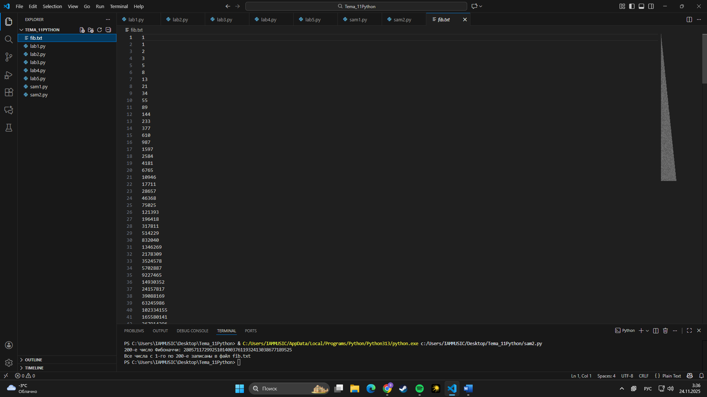

# Тема 11. Итераторы и генераторы
Отчет по Теме #11 выполнил:
- **Студент: Конев Глеб Олегович**
- **Группа: ИВТ-23-1**

| Задание | Лаб_раб | Сам_раб |
| ------ | ------ | ------ |
| Задание 1 | + | + |
| Задание 2 | + | + |
| Задание 3 | + |  |
| Задание 4 | + |  |
| Задание 5 | + |  |

знак "+" - задание выполнено; знак "-" - задание не выполнено;

Работу проверил:
- Ассистент кафедры информационных технологий и статистики, Ротенштрайх Татьяна Викторовна.

## Лабораторная работа №1
### Создание простого итератора без гибкой настройки

``` python
numbers = [0, 1, 2, 3, 4, 5]
for item in numbers: 
    print(item)
```

### Результат:


## Лабораторная работа №2
### Класс итератор с гибкой настройкой 

```python
class CountDown:
    def __init__(self, start):
        self.count = start + 1

    def __iter__(self):
        return self
    
    def __next__(self):
        self.count -= 1
        if self.count < 0:
            raise StopIteration
        return self.count
    
if __name__ == '__main__':
    counter = CountDown(5)
    for i in counter:
        print(i)
```
### Результат:


## Лабораторная работа №3
### Генератор списка

```python
a = [i ** 2 for i in range(1, 5)]

print('a - ', a)
for i in a:
    print(i)

print('iter(a) - ', iter(a))
for i in a: 
    print(i)
```
### Результат:

  
## Лабораторная работа №4
### Выражения генераторы

```python
b = (i ** 2 for i in range(1, 5))
print(b) 
print('first')
for i in b:
    print(i)
print('second')

for i in b:
    print(i)
```

### Результат:


## Лабораторная работа №5
### Такой же счётчик, как и в первом задании, только это генератор и используется yield

```python
def countdown(count):
    while count >= 0:
        yield count
        count -= 1

if __name__ == '__main__':
    counter = countdown(5)
    for i in counter:
        print(i)
```
### Результат.


## Самостоятельная работа №1
### Написать функцию-генератор fib(n), которая с помощью yield выдаёт n чисел Фибоначчи, начиная с 1 и 1. В основной программе получить из неё 200-е число Фибоначчи и вывести его в консоль.

```python
def fib(n):
    a, b = 1, 1
    for _ in range(n):      
        yield a
        a, b = b, a + b


if __name__ == "__main__":
    fib_200 = None

    for fib_200 in fib(200):
        pass

    print(fib_200)
```
### Результат:


## Вывод:
- В данной программе реализована функция-генератор fib(n), которая с помощью оператора yield по очереди выдаёт числа Фибоначчи, начиная с 1 и 1. С помощью цикла for и итератора генератора было получено и выведено в консоль 200-е число Фибоначчи, при этом вся последовательность целиком в памяти не хранилась.
  
## Самостоятельная работа №2
### К программе из 1-й задачи добавить запись всех полученных чисел Фибоначчи в файл fib.txt, по одному числу в каждой строке.

```python
def fib(n):
    a, b = 1, 1
    for _ in range(n):
        yield a
        a, b = b, a + b


if __name__ == "__main__":
    fib_200 = None

    with open("fib.txt", "w", encoding="utf-8") as f:
        for fib_200 in fib(200):
            f.write(str(fib_200) + "\n")

    print("200-е число Фибоначчи:", fib_200)
    print("Все числа с 1-го по 200-е записаны в файл fib.txt")
```


### Результат:



## Вывод:
- Программа из первой задачи была дополнена записью всех сгенерированных чисел Фибоначчи в текстовый файл fib.txt, по одному числу в строке. Для этого использовались файловые операции open в режиме записи, метод write,а также всё те же возможности генератора fib(n) и цикла for для поочерёдного получения значений.

## Общий вывод по работе:
- В ходе выполнения лабораторной работы я разобрался, как в Python работать с итераторами и генераторами. На простых примерах я использовал встроенные итераторы для списков, написал свой класс-итератор - обратный счётчик, поработал с генераторами списков и выражениями-генераторами, а также с функциями-генераторами на основе yield.

- Затем эти приёмы я применил в практических задачах с числами Фибоначчи: реализовал генератор fib(n), с его помощью вычислил 200-е число без хранения всей последовательности в памяти и записал первые 200 чисел Фибоначчи построчно в файл fib.txt. В итоге я увидел, что итераторы и генераторы позволяют удобно работать с последовательностями и экономно использовать память, особенно при больших вычислениях.
