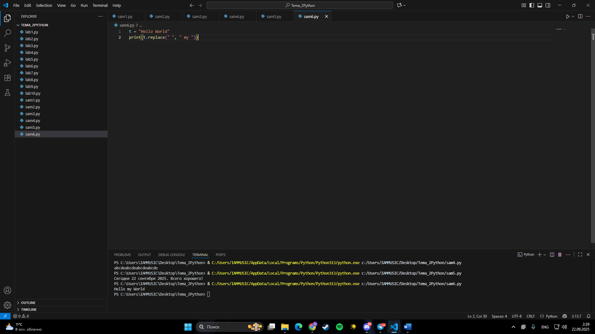
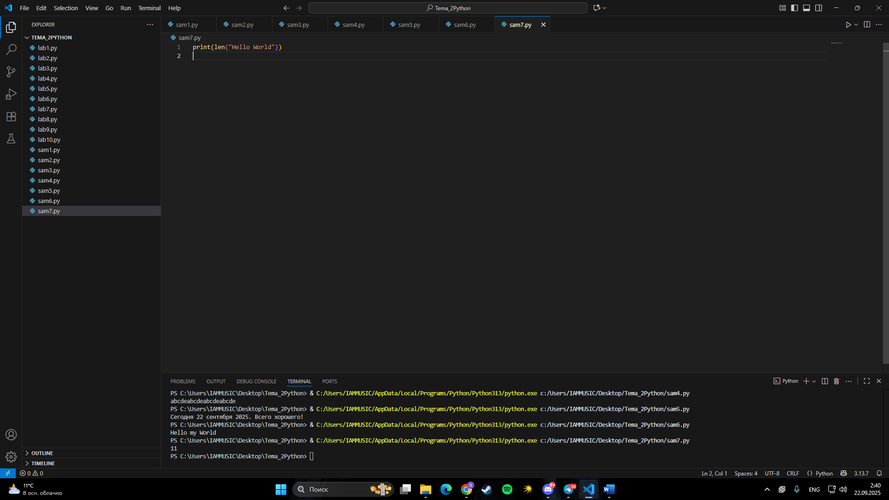
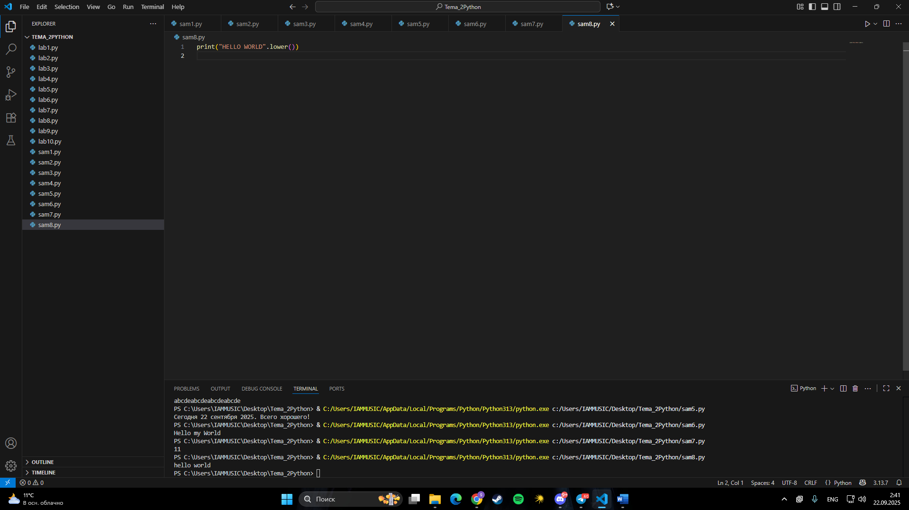
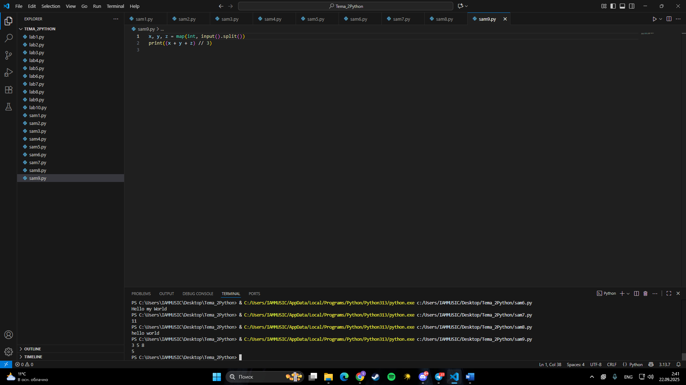
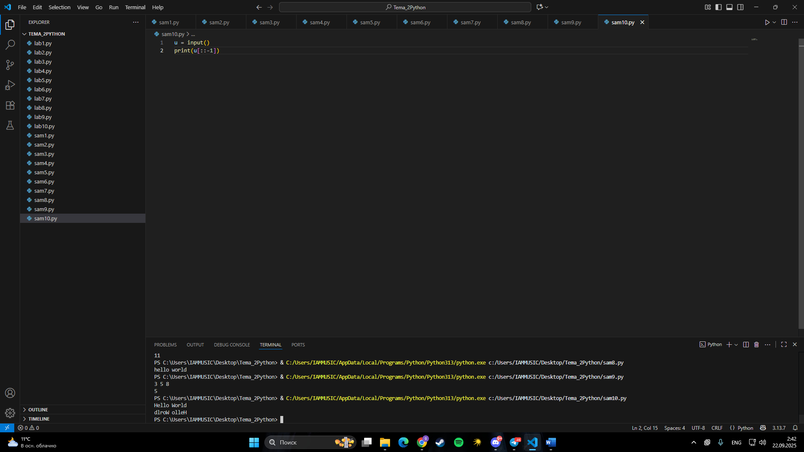

# Тема 2. Базовые операции языка Python
Отчет по Теме #2 выполнил:
- Конев Глеб Олегович
- ИВТ-23-1

| Задание | Лаб_раб | Сам_раб |
| ------ | ------ | ------ |
| Задание 1 | + | + |
| Задание 2 | + | + |
| Задание 3 | + | + |
| Задание 4 | + | + |
| Задание 5 | + | + |
| Задание 6 | + | + |
| Задание 7 | + | + |
| Задание 8 | + | + |
| Задание 9 | + | + |
| Задание 10 | + | + |

знак "+" - задание выполнено; знак "-" - задание не выполнено;

Работу проверили:
- Ассистент кафедры информационных технологий и статистики, Ротенштрайх Татьяна ВикторовнаА.

## Лабораторная работа №1
### Выведите в консоль три строки. Первая – любое число. Вторая – любое число в виде строки. Третья – любое число с плавающей точкой.

```python
print(123)
print('123')
print(1.23)
```
### Результат.


## Лабораторная работа №2
### Введите в консоль три строки. Первая - результат сложения или вычитания минимум двух переменных типа int. Вторая - результат сложения или вычитания минимум двух переменных типа float. Третья — результат сложения или вычитания минимум двух переменных типа int и float.
```python
print(1823-486)
print(5.1 + 8.27)
print(3 + 7.04 + 1 + 2.33)
```
### Результат.


## Лабораторная работа №3
### Введите в консоль три строки. Первая - обратная строка. Вторая — строка с использованием заранее объявленной переменной. Третья — сложить две и более строки в одну.
```python
print('Привет, Мир!')

world = 'Мир'
print(f'Привет, {world}')

one = 'Привет, '
two = 'Мир!'
print(one+two)
```
### Результат.

  
## Лабораторная работа №4
### Введите в консоль ТРИ строки. Первая - трансформация любого типа переменной в bool. Вторая — трансформация любого типа переменной в float или int. Третья - трансформация любого типа переменной в str.
```python
one = 'Hello'
print(bool(one))

two = 142
print(float(two))

three = None
print(str(three))
```
### Результат.


## Лабораторная работа №5
### Присвойте трём переменным разные значения. Воспользуйтесь функцией input().
```python
one = input('one:')
two = input('two:')
three = input('three:')
print(one, two, three)
```
### Результат.


## Лабораторная работа №6
### Создайте две любые числовые переменные и выполните над ними несколько математических операций: возведение в степень, обычное деление, целочисленное деление, нахождение остатка от деления. При желании вы можете проверить, как работают эти вычисления с разными типами данных, например, сначала создать две переменные int, затем создать две переменные float и наконец создать переменные типа int и float и провести над ними операции, прописанные выше.
```python
a = 12
b = 5
print('Возведение в степень: ', a**b)
print('Обычные деление: ', a/b)
print('Целочисленное деление: ', a//b)
print('Нахождение остатка от деления: ', a%b)
```
### Результат.


## Лабораторная работа №7
### Создайте любую строковую переменную и произведите на ней математическое действие умножение на любое число.
```python
line = 'Hello!'
print(line*6)
```
### Результат.


## Лабораторная работа №8
### Посчитайте, сколько раз символ 'o' встречается в строке ‘Hello World’.
```python
sentance = 'Hello World!'
print(sentance.count('o'))
```
### Результат.


## Лабораторная работа №9
### Напишите предложение ‘Hello World’ в две строки. Написанная программа должна занимать одну строку в редакторе кода.
```python
print('Hello\nWorld')
```
### Результат.


## Лабораторная работа №10
### Из предложения ‘Hello World’ выведите в консоль только 2 символ, а затем выведите слово “Hello”.
```python
sentance = 'Hello World'
print(sentance[1])
print(sentance[:5])
```
### Результат.


## Самостоятельная работа №1
### Выведите в консоль булевую переменную False, не используя слово False в строке или изначально присвоенную булевую переменную. Программа должна занимать не более двух строк редактора кода.
```python
print(1>2)
```
### Результат.


## Вывод
Булево значение
Программа выведет False, так как сравнение 1 > 2 ложно.
  
## Самостоятельная работа №2
### Присвойте значения трем переменным и выведите их в консоль, используя только две строки редактора кода.
```python
a, b, c = 1, 2, 3
print(a, b, c)
```
### Результат.


## Вывод
Три переменные
В консоль выведется: 1 2 3. Это демонстрирует возможность объединения нескольких операций в одной строке через точку с запятой.
  
## Самостоятельная работа №3
### Реализуйте ввод данных в программу через консоль в виде только целых чисел (тип данных int). То есть при вводе буквенных символов в консоль программа не должна работать. Программа должна занимать не более двух строк редактора кода.
```python
n = int(input()) 
print(n)
```
### Результат.


## Вывод
Функция int() автоматически преобразует ввод пользователя в целое число. 
Если ввести, например, 5, программа выведет 5. При вводе буквы произойдёт ошибка.
  
## Самостоятельная работа №4
### Создайте только одну строковую переменную. Длина строки должна не превышать 5 символов. На выходе мы должны получить строку длиной не менее 16 символов. Программа должна занимать не более двух строк редактора кода.
```python
s = "abcde"
print(s * 4)
```
### Результат.


## Вывод
Строка длиной ≤5, итог ≥16
Пример: "abcdeabcdeabcdeabcde" (20 символов).
  
## Самостоятельная работа №5
### Создайте три переменные: день (тип данных - числовой), месяц (тип данных - строка), год (тип данных - числовой) и выведите в консоль текущую дату в формате: “Сегодня день месяц год. Всего хорошего!” используя F-строку и оператор end внутри print(), в котором вы должны написать фразу “Всего хорошего!”. Программа должна занимать не более двух строк редактора кода.
```python
day, month, year = 22, "сентября", 2025  
print(f"Сегодня {day} {month} {year}.", end=" Всего хорошего!\n")
```
### Результат.


## Вывод
F-строка f"...{переменная}..." позволяет подставлять значения прямо внутрь текста, а параметр end в print добавляет продолжение без переноса строки.
  
## Самостоятельная работа №6
### В предложении ‘Hello World’ вставьте ‘my’ между двумя словами. Выведите полученное предложение в консоль в одну строку. Программа должна занимать не более двух строк редактора кода.
```python
t = "Hello World"
print(t.replace(" ", " my "))
```
### Результат.


## Вывод
Метод replace(" ", " my ") заменяет пробел в строке "Hello World" на " my ", в результате получается "Hello my World".
  
## Самостоятельная работа №7
### Узнайте длину предложения ‘Hello World’, результат выведите в консоль. Программа должна занимать не более двух строк редактора кода.
```python
print(len("Hello World"))
```
### Результат.


## Вывод
Функция len("Hello World") возвращает количество символов в строке, включая пробел.
  
## Самостоятельная работа №8
### Переведите предложение ‘HELLO WORLD’ в нижний регистр. Программа должна занимать не более двух строк редактора кода.
```python
print("HELLO WORLD".lower())
```
### Результат.


## Вывод
Метод .lower() преобразует все символы строки "HELLO WORLD" в строчные буквы, результат "hello world".
  
## Самостоятельная работа №9
### Самостоятельно придумайте задачу по проходимой теме и решите ее. Задача должна быть связана со взаимодействием с числовыми значениями.
```python
x, y, z = map(int, input().split())  # пример ввода: 3 5 8
print((x + y + z) // 3)
```
### Результат.


## Вывод
Функция map(int, input().split()) преобразует введённые значения в целые числа, а формула (x+y+z)//3 считает их целочисленное среднее.
  
## Самостоятельная работа №10
### Самостоятельно придумайте задачу по проходимой теме и решите ее. Задача должна быть связана со взаимодействием со строковыми значениями.
```python
u = input()
print(u[::-1])
```
### Результат.


## Вывод
Срез [::-1] разворачивает строку в обратном порядке, например "Hello World" превращается в "dlroW olleH".

## Общий вывод
В данной лабораторной работе были рассмотрены базовые операции языка Python: вывод булевых значений, работа с переменными, ввод и преобразование данных, операции со строками и числами. На примерах показано использование встроенных функций и методов: print(), input(), int(), len(), а также строковых методов .replace(), .lower() и приёмов работы со срезами [::-1].

Выполнение заданий позволило закрепить навыки:

создавать и присваивать значения переменным;

использовать арифметические операции и преобразование типов;

обрабатывать пользовательский ввод;

применять строковые методы для замены, изменения регистра, вычисления длины и переворота текста;

использовать f-строки и параметры функций для форматированного вывода.
