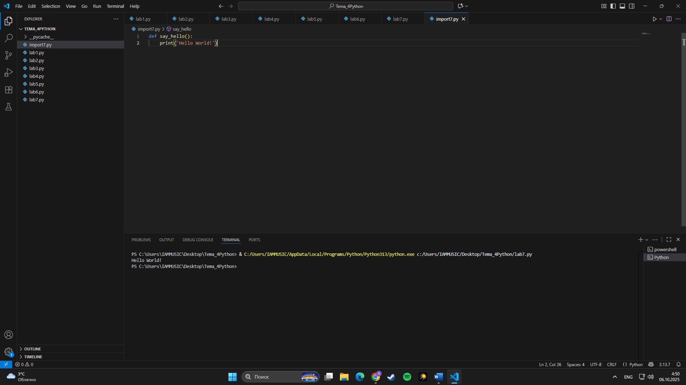
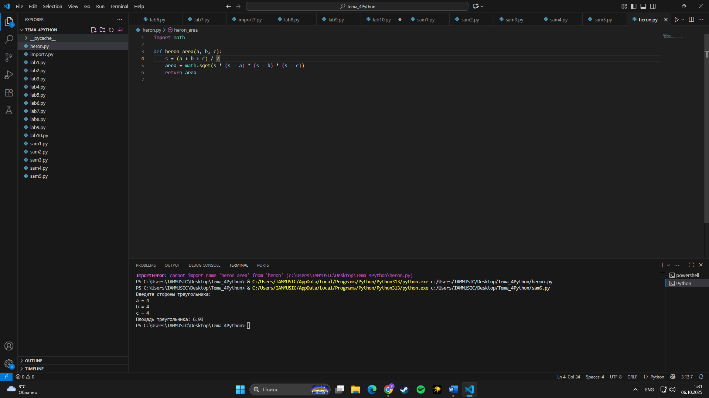

# Тема 4. Функции и модули
Отчет по Теме #4 выполнил:
- Конев Глеб Олегович
- ИВТ-23-1

| Задание | Лаб_раб | Сам_раб |
| ------ | ------ | ------ |
| Задание 1 | + | + |
| Задание 2 | + | + |
| Задание 3 | + | + |
| Задание 4 | + | + |
| Задание 5 | + | + |
| Задание 6 | + |  |
| Задание 7 | + |  |
| Задание 8 | + |  |
| Задание 9 | + |  |
| Задание 10 | + |  |

знак "+" - задание выполнено; знак "-" - задание не выполнено;

Работу проверили:
- Ассистент кафедры информационных технологий и статистики, Ротенштрайх Татьяна Викторовна.

## Лабораторная работа №1
### Напишите функцию, которая выполняет любые арифметические действия и выводит результат в консоль. Вызовите функцию используя «точку входа».

```python
def main():
    print(2+2)

if __name__ == '__main__':
    main()
```
### Результат:


## Лабораторная работа №2
### Напишите функцию, которая выполняет любые арифметические действия, возвращает при помощи return значение в место, откуда вызывали функцию. Выведите результат в консоль. Вызовите функцию используя «точку входа».

```python
def main():
    result = 2+2
    return result

if __name__ == '__main__':
    answer = main()
    print(answer)
```
### Результат:


## Лабораторная работа №3
### Напишите функцию, в которую передаются два аргумента, над ними производится арифметическое действие, результат возвращается туда, откуда эту функцию вызывали. Выведите результат в консоль. Вызовите функцию в любом небольшом цикле.

```python
def main(one, two):
    return one+two

for i in range(5):
    answer = main(one=1, two=10)
    print(answer)
```
### Результат:

  
## Лабораторная работа №4
### Напишите функцию, на вход которой подается какое-то изначально неизвестное количество аргументов, над которыми будет производиться арифметические действия. Для выполнения задания необходимо использовать кортеж «*args».

```python
def main(x, *args):
    one = x
    two = sum(args)
    three = float(len(args))
    print(f"one={one}\ntwo={two}\nthree={three}")
    return x + sum(args) / float(len(args))

if __name__ == '__main__':
    result = main(10, 0 , 1, 2, -1 , 0, -1, 1, 2)
    print(f"\nresult={result}")
```
### Результат:


## Лабораторная работа №5
### Напишите функцию, которая на вход получает кортеж «**kwargs» и при помощи цикла выводит значения, поступившие в функцию.

```python
def main(**kwargs):
    for i in kwargs.items():
        print(i[0], i[1])
    
    print()

    for key in kwargs:
        print(f"{key}={kwargs[key]}")

if __name__ == '__main__':
    main(x=[1, 2, 3], y=[3, 3, 0], z=[2, 3, 0], q=[3, 3, 0], w=[3,3,0])
    print()
    main(**{'x': [1, 2, 3], 'y': [3, 3, 0]})
```
### Результат:


## Лабораторная работа №6
### Напишите две функции. Первая – получает в виде параметра «**kwargs». Вторая считает среднее арифметическое из значений первой функции. Вызовите первую функцию используя «точку входа» и минимум 4 аргумента.

```python
def main(**kwargs):
    
    for i, j in kwargs.items():
        print(f"{i}. Mean = {mean(j)}")

def mean(data):
    return sum(data) / float(len(data))

if __name__ == '__main__':
    main(x=[1, 2, 3], y=[3, 3, 0])  
```
### Результат:


## Лабораторная работа №7
### Создайте дополнительный файл .py. Напишите в нем любую функцию, которая будет что угодно выводить в консоль, но не вызывайте ее в нем. Откройте файл main.py, импортируйте в него функцию из нового файла и при помощи «точки входа» вызовите эту функцию.

```python
from import7 import say_hello

if __name__ == '__main__':
        say_hello()
```

Файл import7.py
```python
def say_hello():
    print('Hello World!')
```
### Результат:



## Лабораторная работа №8
### Напишите программу, которая будет выводить корень, синус, косинус полученного от пользователя числа.

```python
from math import *

def main():
    value = int(input('Введите значение: '))
    print(sqrt(value))
    print(sin(value))
    print(cos(value))

if __name__ == '__main__':
    main()
```
### Результат:


## Лабораторная работа №9
### Напишите программу, которая будет рассчитывать какой день будет через n-ное количество дней, которое укажет пользователь.

```python
from datetime import datetime as dt
from datetime import timedelta as td

def main():
    print(
        f"Сегодня {dt.today().date()}. "
        f"День недели -  {dt.today().isoweekday()}"
    )
    n = int(input('Введите количество дней: '))
    today = dt.today()
    result = today +td(days=n)
    print(
        f"Через {n} дней будет {result.date()}. "
        f"День недели -  {result.isoweekday()}"
    )

if __name__ == '__main__':
    main()
```
### Результат:


## Лабораторная работа №10
### Напишите программу с использованием глобальных переменных, которая будет считать площадь треугольника или прямоугольника в зависимости от того, что выберет пользователь. Получение всей необходимой информации реализовать через input(), а подсчет площадей выполнить при помощи функций. Результатом программы будет число, равное площади необходимой фигуры.

```python
global result

def rectangle():
    a = float(input("Ширина: "))
    b = float(input("Высота: "))
    global result
    result = a*b

def triangle():
    a = float(input("Основание: "))
    h = float(input("Высота: "))
    global result
    result = 0.5 *a*h

figure = input('1-прямоугольник, 2-треугольник ')

if figure == '1':
    rectangle()
elif figure == '2':
    triangle()

print(f"Площадь: {result}")
```
### Результат:


## Самостоятельная работа №1
### Дайте подробный комментарий к коду, написанному ниже.


```python
# Импортируем класс datetime из модуля datetime
from datetime import datetime

# Импортируем функцию sqrt (квадратный корень) из модуля math
from math import sqrt

# Определяем функцию main, которая принимает неограниченное количество именованных аргументов (**kwargs)
def main(**kwargs):
    # Перебираем все элементы словаря kwargs (пары "ключ: значение")
    for key in kwargs.items():
        # key[0] — имя аргумента (например, 'one')
        # key[1] — значение (например, [10, 3])
        # Вычисляем корень квадратный из суммы квадратов элементов списка
        result = sqrt(key[1][0] ** 2 + key[1][1] ** 2)
        # Выводим результат в консоль
        print(result)

# Проверяем, запущен ли файл напрямую, а не импортирован как модуль
if __name__ == '__main__':
    # Сохраняем текущее время для измерения длительности выполнения программы
    start_time = datetime.now()

    # Вызываем функцию main с несколькими именованными аргументами-списками
    main(
        one=[10, 3],
        two=[5, 4],
        three=[15, 13],
        four=[93, 53],
        five=[133, 15]
    )

    # Вычисляем затраченное время
    time_costs = datetime.now() - start_time
    # Выводим время выполнения программы
    print(f"Время выполнения программы - {time_costs}")
```
### Результат:


## Вывод:
- Программа вычисляет длину вектора (гипотенузу) для нескольких пар чисел, переданных в функцию в виде именованных аргументов. Каждый результат выводится на экран.
- Подробно прокомментировал каждую строку кода, комментарии выше, в самом коде, объяснил назначение каждой инструкции и принцип работы программы.
  
## Самостоятельная работа №2
### Напишите программу, которая будет заменять игральную кость с 6 гранями. Если значение равно 5 или 6, то в консоль выводится «Вы победили», если значения 3 или 4, то вы рекурсивно должны вызвать эту же функцию, если значение 1 или 2, то в консоль выводится «Вы проиграли». При этом каждый вызов функции необходимо выводить в консоль значение “кубика”. Для выполнения задания необходимо использовать стандартную библиотеку random. Программу нужно написать, используя одну функцию и “точку входа”.

```python
import random

def roll_dice():
    
    cube = random.randint(1, 6)
    print(f"Выпало значение кубика: {cube}")

    if cube in (5, 6):
        print("Вы победили!")
    elif cube in (3, 4):
        print("Пробуем ещё раз...")
        roll_dice() 
    else:
        print("Вы проиграли!")

if __name__ == "__main__":
    roll_dice()
```
### Результат:


## Вывод:
- Программа имитирует бросок игрального кубика. Если выпадает 5 или 6 — пользователь побеждает, если 1 или 2 — проигрывает, а если 3 или 4 — программа вызывает саму себя повторно (рекурсия) и бросает кубик снова.
- Что используется:
Модуль random и функция randint() для генерации случайных чисел
Условные конструкции (if, elif, else)
Рекурсия (функция вызывает сама себя)
Точка входа программы
  
## Самостоятельная работа №3
### Напишите программу, которая будет выводить текущее время с точностью до секунд на протяжении 5 секунд. Программу нужно написать с использованием цикла. Подсказка: необходимо использовать модуль datetime и time, а также вам необходимо как-то “усыплять” программу на 1 секунду.

```python
from datetime import datetime
import time

def show_time():
    for i in range(5):  
        print(datetime.now().strftime("%H:%M:%S"))
        time.sleep(1)

if __name__ == "__main__":
    show_time()
```
### Результат:


## Вывод:
- Программа выводит текущее время с точностью до секунд в течение 5 секунд, каждую секунду обновляя значение.
- Что используется:
Модуль datetime для получения текущего времени
Модуль time и функция sleep(1) для задержки выполнения программы
Цикл for для многократного повторения действия

## Самостоятельная работа №4
### Напишите программу, которая считает среднее арифметическое от аргументов вызываемой функции, с условием того, что изначальное количество этих аргументов неизвестно. Программу необходимо реализовать, используя одну функцию и “точку входа”.

```python
def average(*args):
    if len(args) == 0:
        print("Нет данных для вычисления.")
        return
    avg = sum(args) / len(args)
    print(f"Среднее арифметическое: {avg}")

if __name__ == "__main__":
    average(10, 20, 30, 40, 50)
```
### Результат:


## Вывод:
- Программа вычисляет среднее арифметическое для любого количества чисел, переданных функции.
- Что используется:
Аргументы переменной длины (*args)
Функции sum() и len()
Условная проверка на наличие аргументов
  
## Самостоятельная работа №5
### ССоздайте два Python файла. В одном будет выполняться вычисление площади треугольника при помощи формулы Герона (необходимо реализовать через функцию), а во втором будет происходить взаимодействие с пользователем (получение всей необходимой информации и вывод результатов). Напишите эту программу и выведите в консоль полученную площадь.

```python
from heron import heron_area

def main():
    print("Введите стороны треугольника:")
    a = float(input("a = "))
    b = float(input("b = "))
    c = float(input("c = "))

    result = heron_area(a, b, c)

    print(f"Площадь треугольника: {result:.2f}")

if __name__ == "__main__":
    main()
```

Файл heron.py
```python
import math

def heron_area(a, b, c):
    s = (a + b + c) / 2
    area = math.sqrt(s * (s - a) * (s - b) * (s - c))
    return area
```
### Результат:



## Вывод:
- В первом файле реализована функция, вычисляющая площадь треугольника по формуле Герона.
Во втором файле программа взаимодействует с пользователем: запрашивает длины сторон, вызывает функцию из первого файла и выводит площадь треугольника.

- Что используется:
Разделение программы на два файла (импорт модулей)
Математические операции и функция sqrt() из модуля math
Ввод данных с клавиатуры (input())
Формула Герона для вычисления площади треугольника

## Общий вывод:

В ходе выполнения всех заданий была продемонстрирована основа работы с функциями и модулями в Python — ключевыми элементами структурного и модульного программирования.

Каждое задание последовательно развивает понимание того, как организовать код:

использовать функции для повторяющихся действий,

передавать им аргументы разного типа и количества,

применять встроенные модули (math, datetime, time, random) для решения практических задач,

разделять программу на несколько файлов и использовать импорт для повторного использования кода.

Также рассмотрены важные концепции:

рекурсия — как функция может вызывать саму себя;

измерение времени выполнения программы;

работа с задержками и циклическим выводом данных;

взаимодействие с пользователем через ввод и вывод информации;

модульность кода, позволяющая создавать более гибкие и масштабируемые программы.
## Итог:
Выполненные задания показывают, как из простых конструкций Python можно создавать логически завершённые, понятные и расширяемые программы. Эти примеры закладывают фундамент для более сложных тем
