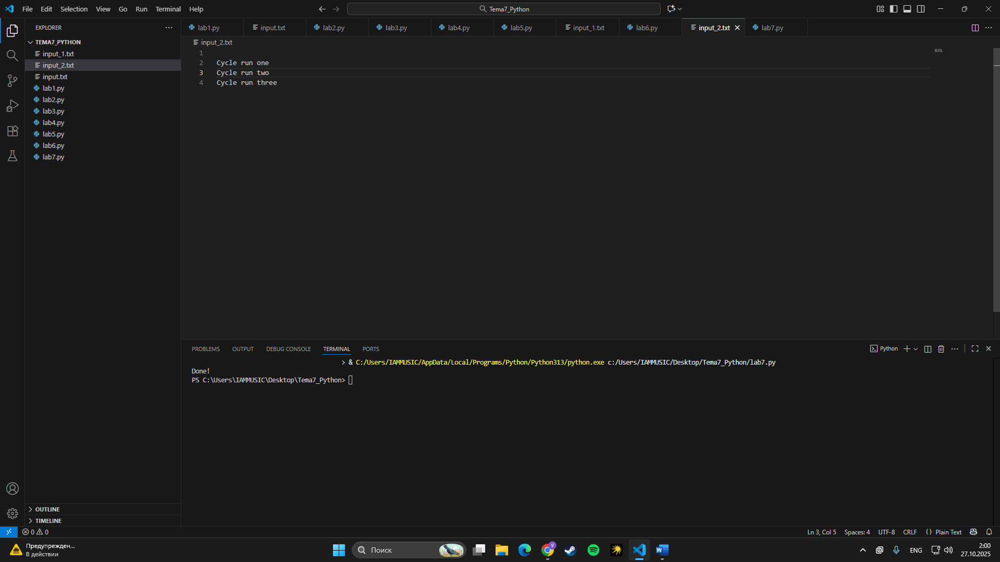
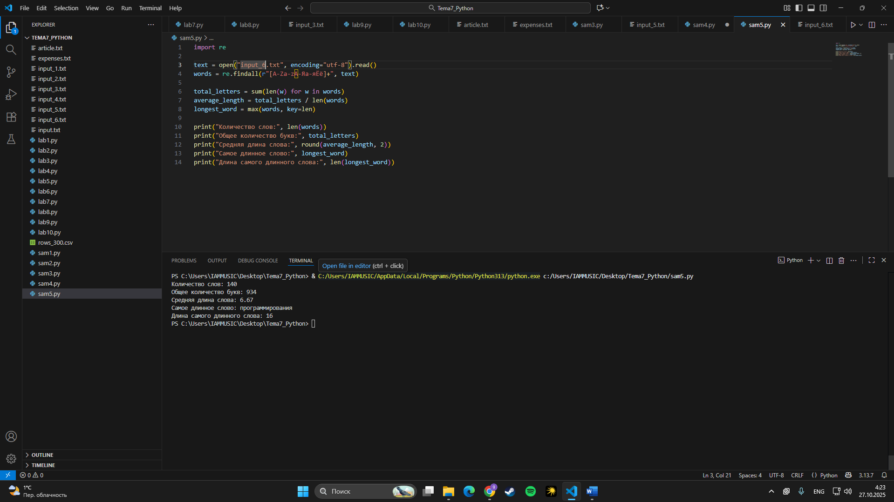

# Тема 7. Работа с файлами (ввод, вывод)
Отчет по Теме #7 выполнил:
- **Студент: Конев Глеб Олегович**
- **Группа: ИВТ-23-1**

| Задание | Лаб_раб | Сам_раб |
| ------ | ------ | ------ |
| Задание 1 | + | + |
| Задание 2 | + | + |
| Задание 3 | + | + |
| Задание 4 | + | + |
| Задание 5 | + | + |
| Задание 6 | + |  |
| Задание 7 | + |  |
| Задание 8 | + |  |
| Задание 9 | + |  |
| Задание 10 | + |  |

знак "+" - задание выполнено; знак "-" - задание не выполнено;

Работу проверил:
- Ассистент кафедры информационных технологий и статистики, Ротенштрайх Татьяна Викторовна.

## Лабораторная работа №1
### Создайте текстовый файл в той же папке, что и программа, и впишите в него минимум две строки текста.


``` input.txt
Hello World!
Programming in python
```

### Результат:


## Лабораторная работа №2
### Напишите программу, которая выведет только первую строку из вашего файла, при этом используйте конструкцию open()/close().

``` input.txt
Hello World!
Programming in python
```

```python
f = open ('input.txt', 'r')
print(f.readline())
f.close()

```
### Результат:


## Лабораторная работа №3
### Напишите программу, которая выведет все строки из вашего файла в массиве, при этом используйте конструкцию open()/close().

``` input.txt
Hello World!
Programming in python
```

```python
f = open ('input.txt', 'r')
print(f.readlines())
f.close()

```
### Результат:

  
## Лабораторная работа №4
### Напишите программу, которая выведет все строки из вашего файла в массиве, при этом используйте конструкцию with open().

input.txt
```
Hello World!
Programming in python
```

```python
with open('input.txt', 'r') as f:
    print(f.readlines())
```

### Результат:


## Лабораторная работа №5
### Напишите программу, которая выведет каждую строку из вашего файла отдельно, при этом используйте конструкцию with open().

``` input.txt
Hello World!
Programming in python
```

```python
with open('input.txt') as f:
    for line in f:
        print(line)
```
### Результат:


## Лабораторная работа №6
### Напишите программу, которая добавляет новую строку в файл и затем выводит весь его текст в консоль. После запуска убедитесь, что изменения появились в самом файле.

``` input_1.txt
Hello World!
Programming in python
My name is Gleb
```

```python
with open('input_1.txt', 'a+') as f:
    f.write('\nIm additional line')

with open('input_1.txt', 'r') as f:
    result = f.readlines()
    print(result)
```
### Результат:


## Лабораторная работа №7
### Напишите программу, которая полностью перезапишет содержимое файла, например, запишет несколько строк из созданного вами списка. После выполнения убедитесь, что новые данные сохранились в файле.


``` input_2.txt
Cycle run one
Cycle run two
Cycle run three
```

```python
lines = ['one', 'two', 'three']
with open('input_2.txt', 'w') as f:
    for line in lines:
        f.write('\nCycle run '+line)
    print('Done!')
```
### Результат:



## Лабораторная работа №8
### Выберите любую папку на своем компьютере, имеющую вложенные директории. Выведите на печать в терминал ее содержимое, как и всех подкаталогов при помощи функции print docs(directory).

```python
import os

def print_docs(directory):
    all_files = os.walk(directory)
    for catalog in all_files:
        print(f'Папка {catalog[0]} содержит: ')
    print(f'Директории: {", ".join([folder for folder in catalog[1]])}')
    print(f'Файлы: {", ".join([file for file in catalog[2]])}')
    print('-'*48)

print_docs(r"C:\Users\IAMMUSIC\Desktop\Tema_5Python")
```
### Результат:


## Лабораторная работа №9
### Документ «input.txt» содержит следующий текст:

- Приветствие
- Спасибо
- Извините
- Пожалуйста
- До свидания
- Ты готов?
- Как дела?
- С днем рождения!
- Удача!
- Я тебя люблю.

Требуется реализовать функцию, которая выводит слово, имеющее максимальную длину (или список слов, если таковых несколько). Проверьте работоспособность программы на своем наборе данных

``` input_3.txt
Приветствие
Спасибо
Извините
Пожалуйста
До свидания
Ты готов?
Как дела?
С днём рождения!
Удача!
Я тебя люблю.
```

```python
def longest_words(file):
    with open(file, encoding='utf-8') as f:
        words = f.read().split()
        max_length = len(max(words, key=len))
        for word in words:
            if len(word) == max_length:
                sought_words = word
        
        if len(sought_words) == 1:
            return sought_words[0]
        return sought_words
    
print(longest_words('input_3.txt'))
```
### Результат:


## Лабораторная работа №10
### Требуется создать csv-файл «rows_300.csv» со следующими столбцами:
- № - номер по порядку (от 1 до 300);
- Секунда – текущая секунда на вашем ПК;
- Микросекунда – текущая миллисекунда на часах.

Для наглядности на каждой итерации цикла искусственно приостанавливайте скрипт на 0,01 секунды.

```python
import csv 
import datetime
import time

with open('rows_300.csv', 'w', encoding='utf-8', newline='') as f:
    writer = csv.writer(f)
    writer.writerow(['№', 'Секунда', 'Микросекунда'])
    for line in range(1,301):
        writer.writerow([line, datetime.datetime.now().second, datetime.datetime.now().microsecond])
        time.sleep(0.01)
```
### Результат.


## Самостоятельная работа №1
### Найдите в интернете статью объёмом ≥ 200 слов, скопируйте её в текстовый файл. Напишите программу, которая:

- читает файл;
- считает общее количество слов;
- определяет самое частое слово (регистр игнорируйте, знаки препинания не считайте) и его частоту.

``` article.txt
Python — это современный, гибкий и читаемый язык программирования, который сегодня считается одним из самых популярных в мире. Он был создан Гвидо ван Россумом в конце 1980-х годов и впервые представлен широкой публике в 1991 году. Основная идея языка — сделать программирование максимально простым и понятным даже для новичков.

Одной из главных особенностей Python является его читаемость. Вместо фигурных скобок для обозначения блоков кода он использует отступы, что делает программы аккуратными и лёгкими для восприятия. Код на Python часто выглядит почти как обычный английский текст, поэтому его просто изучать и поддерживать.

Python поддерживает динамическую типизацию — программисту не нужно указывать тип переменной заранее. Кроме того, в языке реализовано множество готовых библиотек, позволяющих решать разнообразные задачи: от работы с файлами и веб-сайтами до анализа данных и искусственного интеллекта.

Благодаря своей универсальности Python активно используется в науке, образовании, веб-разработке, автоматизации, тестировании и машинном обучении. Многие крупные компании, такие как Google, YouTube и NASA, применяют Python в своих проектах.

Популярность Python продолжает расти, а его сообщество постоянно создаёт новые инструменты и расширения. Именно поэтому Python считается отличным выбором для тех, кто только начинает путь в программировании: он помогает понять основы логики, структур данных и алгоритмов без излишней сложности.Python очень популярный язык программировния многие начинающие программисты начинают свой путь в программирование именно с этого языка.
```

```python
from collections import Counter
import re

text = open("article.txt", encoding="utf-8").read().lower()
words = re.findall(r"[а-яa-z]+", text)

print("Количество слов:", len(words))

count = Counter(words)
word, freq = count.most_common(1)[0]

print("Самое частое слово:", word)
print("Количество повторений:", freq)
```
### Результат:


## Вывод:
Что делает:
Программа читает текст из файла, считает количество слов и находит самое часто встречающееся.
Что использовано:
Регулярные выражения (re) для выделения слов и Counter из модуля collections для подсчёта повторений.
  
## Самостоятельная работа №2
### Создайте простую программу для учёта расходов. Она должна позволять вводить данные о расходах через консоль, сохранять их в файл и выводить все записи обратно на экран. После запуска продемонстрируйте работу программы:
- сделайте скриншот файла с расходами,
- приведите код,
- покажите вывод в консоли, подтверждающий, что данные успешно добавляются и сохраняются.

```python
while True:
    print("1) Добавить расход")
    print("2) Показать расходы")
    print("3) Выход")
    choice = input("Выбор: ")

    if choice == "1":
        date = input("Дата: ")
        category = input("Категория: ")
        amount = input("Сумма: ")
        note = input("Примечание: ")
        f = open("expenses.txt", "a", encoding="utf-8")
        f.write(f"{date},{category},{amount},{note}\n")
        f.close()
    elif choice == "2":
        for line in open("expenses.txt", encoding="utf-8"):
            print(line.strip())
    elif choice == "3":
        break
```
### Результат:


## Вывод:
Что делает:
Позволяет добавлять новые расходы через консоль, сохранять их в файл и просматривать список всех записей.
Что использовано:
Работа с файлами (open, режимы a и r), ввод данных через input() и простые циклы while.
  
## Самостоятельная работа №3
### Имеется файл input.txt с текстом на латинице. Напишите программу, которая выводит следующую статистику по тексту: количество букв латинского алфавита; число слов; число строк.

- Текст в файле:
  Beautiful is better than ugly.
  Explicit is better than implicit.
  Simple is better than complex.
  Complex is better than complicated.

- Ожидаемый результат:
  Input file contains:
   108 letters
   20 words
   4 lines

``` input_4.txt
Beautiful is better than ugly.
Explicit is better than implicit.
Simple is better than complex.
Complex is better than complicated.
```

```python
import re

text = open("input_4.txt", encoding="utf-8").read()
letters = re.findall(r"[A-Za-z]", text)
words = re.findall(r"[A-Za-z]+", text)
lines = text.splitlines()

print("Input file contains:")
print(len(letters), "letters")
print(len(words), "words")
print(len(lines), "lines")
```
### Результат:


## Вывод:
Что делает:
Подсчитывает количество латинских букв, слов и строк в файле input.txt.
Что использовано:
Регулярные выражения (re) для поиска букв и слов, методы работы со строками (splitlines).

## Самостоятельная работа №4
### Напишите программу, которая получает на вход предложение, выводит его в терминал, заменяя все запрещенные слова звездочками * (количество звездочек равно количеству букв в слове). Запрещенные слова, разделенные символом пробела, хранятся в текстовом файле input.txt. Все слова в этом файле записаны в нижнем регистре. Программа должна заменить запрещенные слова, где бы они ни встречались, даже в середине другого слова. Замена производится независимо от регистра.

- Запрещенные слова:  
  hello email python the exam wor is  
- Предложение для проверки:  
  Hello, world! Python IS the programming language of thE future. My  
  EMAIL is....  
  PYTHON is awesome!!!!  
- Ожидаемый результат:  
  ***** **id! ****** ** programming language of *** future. My  
  ****** **...  
  ****** ** awesome!!!!
  
``` input_5.txt
hello email python the exam wor is
```

```python
sentence = """Hello, world! Python IS the programming language of thE future. My
EMAIL is....
PYTHON is awesome!!!!"""

banned = open("input_5.txt", encoding="utf-8").read().lower().split()

print("Исходный текст:\n")
print(sentence)
print("\nПосле цензуры:\n")

s = sentence
s_low = s.lower()
chars = list(s)

for w in banned:
    w = w.lower()
    start = 0
    while True:
        i = s_low.find(w, start)
        if i == -1:
            break
        for j in range(i, i + len(w)):
            chars[j] = "*"
        start = i + 1 

censored = "".join(chars)
print(censored)
```
### Результат:


## Вывод:
Что делает:
Заменяет запрещённые слова из файла input.txt звёздочками, не затрагивая остальные буквы.
Что использовано:
Построчная работа со строкой, метод .find() для поиска подстрок и базовые циклы.
  
## Самостоятельная работа №5
### Самостоятельно придумайте и решите задачу, которая будет взаимодействовать с текстовым файлом.

```input_6.txt
Python — это универсальный язык программирования, созданный для того, чтобы сделать код понятным и простым. Его синтаксис напоминает обычный человеческий язык, благодаря чему даже новичок может быстро начать писать работающие программы. Python поддерживает множество парадигм программирования, включая объектно-ориентированный и функциональный подходы. 

Сегодня язык используется повсюду: в разработке веб-сайтов, анализе данных, искусственном интеллекте, автоматизации задач и даже создании игр. Благодаря огромному количеству библиотек и активному сообществу, Python стал одним из самых популярных языков в мире. Например, библиотеки NumPy и Pandas помогают обрабатывать большие объёмы данных, а TensorFlow и PyTorch применяются для машинного обучения и нейросетей.

Кроме того, Python активно используется в образовании. Его простота делает его отличным выбором для изучения программирования в школах и университетах. Многие известные компании, включая Google, NASA и YouTube, используют Python для своих проектов. Это доказывает, что язык сочетает лёгкость обучения с реальной мощью и возможностями.
```

```python
import re

text = open("input_6.txt", encoding="utf-8").read()
words = re.findall(r"[A-Za-zА-Яа-яЁё]+", text)

total_letters = sum(len(w) for w in words)
average_length = total_letters / len(words)
longest_word = max(words, key=len)

print("Количество слов:", len(words))
print("Общее количество букв:", total_letters)
print("Средняя длина слова:", round(average_length, 2))
print("Самое длинное слово:", longest_word)
print("Длина самого длинного слова:", len(longest_word))
```
### Результат:



## Вывод:
Что делает:
Считает количество слов, общую длину, среднюю длину слова и находит самое длинное слово в тексте.
Что использовано:
Регулярные выражения для выделения слов, функции len(), sum(), max() и простая арифметика для вычислений.

## Общий вывод:

В ходе выполнения всех заданий была изучена и закреплена работа с файлами в языке Python.
Были рассмотрены основные операции — чтение, запись и перезапись файлов, а также способы обработки и анализа текстовой информации.
Использовались различные режимы открытия файлов (r, w, a), методы работы со строками, ввод данных через консоль и вывод результатов в консоль.

Также были применены регулярные выражения для выделения слов, модули collections и time, а в некоторых задачах — циклы и простые условия.
Каждая программа показала практическое применение теории: от простого чтения текста до создания небольших утилит для подсчёта слов, ведения расходов и фильтрации данных.

В результате работы были получены навыки работы с файлами, умение сохранять и обрабатывать данные, что является важной частью любой программы, связанной с вводом и выводом информации.
