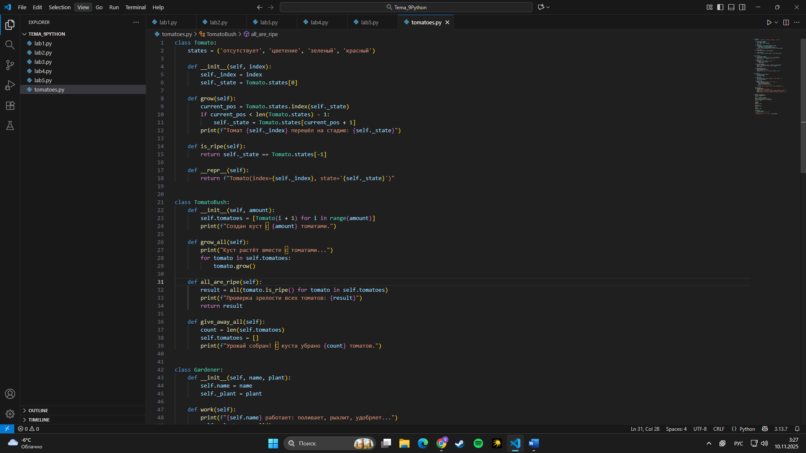
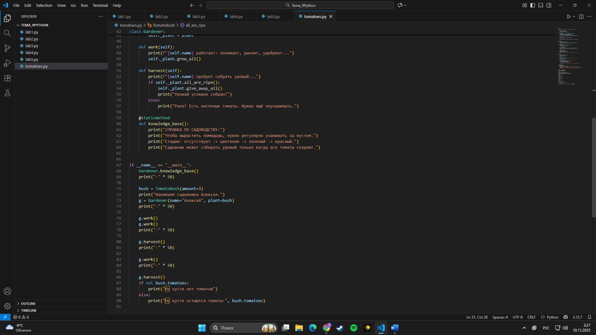

# Тема 9. Концепции и принципы ООП
Отчет по Теме #9 выполнил:
- **Студент: Конев Глеб Олегович**
- **Группа: ИВТ-23-1**

| Задание | Лаб_раб | Сам_раб |
| ------ | ------ | ------ |
| Задание 1 | + | + |
| Задание 2 | + |  |
| Задание 3 | + |  |
| Задание 4 | + |  |
| Задание 5 | + |  |

знак "+" - задание выполнено; знак "-" - задание не выполнено;

Работу проверил:
- Ассистент кафедры информационных технологий и статистики, Ротенштрайх Татьяна Викторовна.

## Лабораторная работа №1
### Создай класс с одним свойством — имя; в __init__ проверь, совпадает ли введённое имя с твоим, и там же обратись к несуществующему атрибуту (например, фамилия), чтобы увидеть ошибку.

``` python
class Ivan:
    __slots__ = ['name']

    def __init__(self, name):
        if name == 'Иван':
            self.name = f"Да, я {name}"
        else:
            self.name = f"Я не {name}, а Иван"


person1 = Ivan('Алексей')
person2 = Ivan('Иван')
print(person1.name)
print(person2.name)

person2.surname = 'Петров'
```

### Результат:


## Лабораторная работа №2
### Создай класс мороженого, который принимает топпинг (только строка) и цену; метод должен печатать «Мороженое с {топпинг}» при валидном топпинге, иначе «Обычное мороженое», и возвращать/показывать итоговую цену после возможного добавления.


```python
class Icecream:
    def __init__(self, ingredient=None):
        if isinstance(ingredient, str):
            self.ingredient = ingredient
        else:
            self.ingredient = None

    def composition(self):
        if self.ingredient:
            print(f"Мороженое с {self.ingredient}")
        else: 
            print('Обычное мороженное')

icecream = Icecream()
icecream.composition()
icecream = Icecream('шоколадом')
icecream.composition()
icecream = Icecream(5)
icecream.composition()
```
### Результат:


## Лабораторная работа №3
### Класс с инкапсуляцией: приватное поле, геттер, сеттер (с проверкой), деструктор; внизу — короткая демонстрация работы и одно предложение, объясняющее ошибку на скриншоте.


```python
class MyClass:
    def __init__(self, value):
        self._value = value

    def set_value(self, value):
        self._value = value

    def get_value(self):
        return self._value
    
    def del_value(self):
        del self._value

    value = property(get_value, set_value, del_value, "Свойство value")

obj = MyClass(42)
print(obj.get_value())
obj.set_value(45)
print(obj.get_value())
obj.set_value(100)
print(obj.get_value())
obj.del_value()
print(obj.get_value()) #удаление атрибута
```
### Результат:


## Вывод:
- Я вызвал obj.del_value(), который удалил у объекта атрибут self._value. Сразу после этого print(obj.get_value()) пытается прочитать self._value, которого уже нет - AttributeError: 'MyClass' object has no attribute '_value'.
  
## Лабораторная работа №4
### Создать базовый класс Млекопитающее, от него унаследовать Кошка и Собака; через наследование показать, что кошки и собаки — млекопитающие, добавить каждому уникальный атрибут или поведение.

```python
class Mammal:
    className = 'Mammal'

class Dog(Mammal):
    species = 'canine'
    sounds = 'wow'

class Cat(Mammal):
    species = 'feline'
    sounds = 'meow'

dog = Dog()
print(f"Dog is {dog.className}, but they say {dog.sounds}")
cat = Cat()
print(f"Cat is {cat.className}, but they say {cat.sounds}")
```

### Результат:


## Лабораторная работа №5
### Реализуй полиморфизм: создай два класса (русский и английский) с атрибутом слова-приветствия и статическим методом greet() (через @staticmethod), затем напиши функцию, которая принимает объекты этих классов и по очереди выводит их приветствия.

```python
class Russian:
    @staticmethod
    def greeting():
        print("Привет")

class English:
    @staticmethod
    def greeting():
        print("Hello")

def greet(language):
    language.greeting()

ivan = Russian()
greet(ivan)
john = English()
greet(john)
```
### Результат:


## Самостоятельная работа №1
### Суть задания: реализовать три класса — Tomato, TomatoBush, Gardener — и показать их работу. Тесты: вызвать справку, создать TomatoBush и Gardener, поухаживать, попробовать ранний сбор, продолжить уход и затем собрать урожай.
### Код с комменатариями:
```python
class Tomato:
    # Стадии созревания (общее для всех томатов)
    states = ('отсутствует', 'цветение', 'зеленый', 'красный')

    def __init__(self, index):
        # Номер томата и начальная стадия
        self._index = index
        self._state = Tomato.states[0]

    def grow(self):
        # Переход на следующую стадию (если не последняя)
        current_pos = Tomato.states.index(self._state)
        if current_pos < len(Tomato.states) - 1:
            self._state = Tomato.states[current_pos + 1]
        print(f"Томат {self._index} перешёл на стадию: {self._state}")

    def is_ripe(self):
        # Томат спелый?
        return self._state == Tomato.states[-1]

    def __repr__(self):
        return f"Tomato(index={self._index}, state='{self._state}')"


class TomatoBush:
    def __init__(self, amount):
        # Куст: создаём N томатов
        self.tomatoes = [Tomato(i + 1) for i in range(amount)]
        print(f"Создан куст с {amount} томатами.")

    def grow_all(self):
        # Растим все томаты
        print("Куст растёт вместе с томатами...")
        for tomato in self.tomatoes:
            tomato.grow()

    def all_are_ripe(self):
        # Проверяем, спелы ли все
        result = all(tomato.is_ripe() for tomato in self.tomatoes)
        print(f"Проверка зрелости всех томатов: {result}")
        return result

    def give_away_all(self):
        # Сбор урожая: очищаем куст
        count = len(self.tomatoes)
        self.tomatoes = []
        print(f"Урожай собран! С куста убрано {count} томатов.")


class Gardener:
    def __init__(self, name, plant):
        # Садовник и растение (куст)
        self.name = name
        self._plant = plant

    def work(self):
        # Уход за растением = рост томатов
        print(f"{self.name} работает: поливает, рыхлит, удобряет...")
        self._plant.grow_all()

    def harvest(self):
        # Сбор: только если все томаты спелые
        print(f"{self.name} пробует собрать урожай...")
        if self._plant.all_are_ripe():
            self._plant.give_away_all()
            print("Урожай успешно собран!")
        else:
            print("Рано! Есть неспелые томаты. Нужно ещё поухаживать.")

    @staticmethod
    def knowledge_base():
        # Короткая справка по логике задачи
        print("СПРАВКА ПО САДОВОДСТВУ:")
        print("Чтобы вырастить помидоры, нужно регулярно ухаживать за кустом.")
        print("Стадии: отсутствует -> цветение -> зеленый -> красный.")
        print("Садовник может собирать урожай только когда все томаты созреют.")


if __name__ == "__main__":
    # Демонстрация работы (тестовый сценарий)
    Gardener.knowledge_base()
    print("-" * 50)

    bush = TomatoBush(amount=3)
    print("Нанимаем садовника Алексея.")
    g = Gardener(name="Алексей", plant=bush)
    print("-" * 50)

    g.work()
    g.work()
    print("-" * 50)

    g.harvest()
    print("-" * 50)

    g.work()
    print("-" * 50)

    g.harvest()
    if not bush.tomatoes:
        print("На кусте нет томатов")
    else:
        print("На кусте остаются томаты:", bush.tomatoes)
```
### Вывод в консоли:
```
СПРАВКА ПО САДОВОДСТВУ:
Чтобы вырастить помидоры, нужно регулярно ухаживать за кустом.
Стадии: отсутствует -> цветение -> зеленый -> красный.
Садовник может собирать урожай только когда все томаты созреют.
--------------------------------------------------
Создан куст с 3 томатами.
Нанимаем садовника Алексея.
--------------------------------------------------
Алексей работает: поливает, рыхлит, удобряет...
Куст растёт вместе с томатами...
Томат 1 перешёл на стадию: цветение
Томат 2 перешёл на стадию: цветение
Томат 3 перешёл на стадию: цветение
Алексей работает: поливает, рыхлит, удобряет...
Куст растёт вместе с томатами...
Томат 1 перешёл на стадию: зеленый
Томат 2 перешёл на стадию: зеленый
Томат 3 перешёл на стадию: зеленый
--------------------------------------------------
Алексей пробует собрать урожай...
Проверка зрелости всех томатов: False
Рано! Есть неспелые томаты. Нужно ещё поухаживать.
--------------------------------------------------
Алексей работает: поливает, рыхлит, удобряет...
Куст растёт вместе с томатами...
Томат 1 перешёл на стадию: красный
Томат 2 перешёл на стадию: красный
Томат 3 перешёл на стадию: красный
--------------------------------------------------
Алексей пробует собрать урожай...
Проверка зрелости всех томатов: True
Урожай собран! С куста убрано 3 томатов.
Урожай успешно собран!
На кусте нет томатов
```
### Результаты:



### Вывод: 
- Реализована система классов:Tomato — хранит стадию помидора и умеет переходить к следующей.TomatoBush — содержит список томатов, растит их разом, проверяет зрелость всех и «отдаёт» урожай.Gardener — ухаживает за кустом заставляет расти и собирает урожай, когда все спелые.В итоге программа показывает весь цикл выращивания томатов: от посадки до сбора.
## Общие выводы по работе:
Что я освоил:
- Инкапсуляция: приватные поля, геттер/сеттер, деструктор; защита и контролируемый доступ к данным.
- Валидация: базовая проверка типов/значений.
- Статические методы: там, где не нужен self.
- Структура классов: проектирование взаимодействующих объектов и разделение ответственности.
Полиморфизм  и готовность к наследованию: единообразные методы у разных сущностей и возможность расширять систему.
Демонстрация принципов ООП на «садовнике и томатах»
Инкапсуляция: служебные поля с подчёркиванием, внешнее управление через методы.
Полиморфизм: единый протокол роста и проверки зрелости у всех томатов.
Расширяемость: архитектура позволяет добавлять новые растения/роли.
Композиция: садовник → куст → томаты, чёткое разделение ролей.
- Итог:
Я уверенно применяю ключевые принципы ООП в Python и могу проектировать и реализовывать системы классов, которые можно будет расширять и тестировать.
